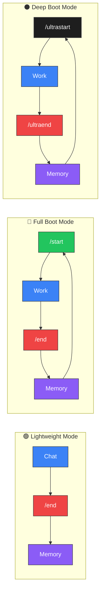

<div align="center">

# Project Athena

**Your memory. Your machine. Any model.**

Open-source cognitive augmentation layer that gives you persistent memory, structured reasoning, and full data ownership — across ChatGPT, Claude, Gemini, and any model you switch to next.

Platforms forget. Athena doesn't.

[](https://github.com/winstonkoh87/Athena-Public/stargazers)
[](LICENSE)
[](docs/CHANGELOG.md)
[](https://www.reddit.com/r/ChatGPT/comments/1r1b3gl/)
[](https://codespaces.new/winstonkoh87/Athena-Public)

[Quickstart](#-quickstart) · [How It Works](#-how-it-works) · [Docs](docs/GETTING_STARTED.md) · [FAQ](Athena-Public.wiki/FAQ.md) · [Safety](SAFETY.md) · [Contributing](CONTRIBUTING.md)

*Last updated: 30 May 2026*

</div>

---

## The Problem

You've spent months training ChatGPT to understand you. Then a model update resets the personality. Your custom instructions stop working. You can't find that conversation from last Tuesday. And if you switch to Claude or Gemini? **You start from zero.**

Platform memory is **unreliable, opaque, and locked to one provider**. You don't own it, you can't inspect it, and you can't take it with you.

## Why Athena?

Athena moves the memory layer to **your machine**. Plain Markdown files that you own, version-control, and point at any model.

- **🧠 Your Memory, Your Machine** — Files on your disk, not in OpenAI's cloud. Read them, edit them, git-version them.
- **🔌 Switch Models Freely** — Claude today, Gemini tomorrow, GPT next week. The memory stays. The model is just whoever's on shift.
- **📈 It Compounds** — Session 500 recalls patterns from session 5. Platform memory decays; Athena's doesn't. The moat isn't the code — it's your data. Anyone can fork Athena; nobody can fork your sessions. [→ The Compounding Effect](Athena-Public.wiki/The-Compounding-Effect.md)
- **⚡ 2K–20K Token Boot** — Scales to the task. Lightweight chat (~2K) → `/start` (~10K) → `/ultrastart` (~20K). 80–98% of your context window stays free, even after 10,000 sessions.
- **🔬 Meta-Game Reasoning** — Generic LLMs optimise *within* the game you're playing. Athena asks whether you should be playing that game at all. [→ Meta-Game Thesis](docs/concepts/Meta_Game_Thesis.md)
- **🛡️ Governed Autonomy** — 6 constitutional laws, 4 capability levels, bounded agency.

> *A generic LLM is a brilliant amnesiac. Athena is the hippocampus — the memory that makes intelligence useful.*
>
> *Or in engineering terms: The LLM is the engine. Athena is the chassis, the memory, and the rules of the road. Swap the engine anytime — the car remembers every road you've driven.*
>
> *The design philosophy: [augment the human, not replace them](docs/concepts/Grace_Protocol.md). After 1,800+ sessions, the bottleneck shifted — [optimising the operator is now higher-leverage than optimising the AI](docs/USER_DRIVEN_RSI.md#phase-2-optimising-the-operator).*

### The Human Augmentation Thesis

Athena's centralised design principle: **augment human cognition, not replace it.** The more context you give Athena, the sharper its answers become — not by remembering your preferences, but by **reasoning differently because of what it knows about you.**

A generic LLM gives the internet's statistically average answer — correct *on average, across all humans*. Athena gives answers calibrated to *your specific situation*, because statistical correctness and personal correctness are completely different things:

<table>
<tr>
<th width="25%">Question</th>
<th width="37%">Generic LLM</th>
<th width="38%">Athena (with your context)</th>
</tr>
<tr>
<td><strong>The Trolley Problem</strong></td>
<td>
“Pull the lever — utilitarian calculus says save five lives.”
</td>
<td>
Challenges the false binary. Generates third options. Asks why you’re on the tracks in the first place. Identifies the systemic failures that created the dilemma. Refuses to solve the wrong problem.
</td>
</tr>
<tr>
<td><strong>“Should I double down on 11 vs dealer’s 6?”</strong></td>
<td>
“Yes — the math says doubling is the optimal play.”
</td>
<td>
“The math is correct, but <strong>you</strong> are betting $4K of your $4K take-home salary. Your utility function makes this −EEV. Law #1: No Irreversible Ruin. <strong>Do not bet.</strong>” — <a href="examples/protocols/decision/330-economic-expected-value.md">Protocol 330</a>
</td>
</tr>
<tr>
<td><strong>“Should I take this job offer?”</strong></td>
<td>
“Consider salary, growth potential, work-life balance...”
</td>
<td>
Cross-references your risk profile, career decision history, financial runway, and the regret patterns from your last 3 career transitions to give a recommendation specific to <em>your</em> situation.
</td>
</tr>
<tr>
<td><strong>“I keep self-sabotaging — why?”</strong></td>
<td>
“Consider therapy, practice self-compassion, journal your triggers.”
</td>
<td>
Same words, 3 different diagnoses depending on <em>who’s asking</em>: attachment wound → IFS unburdening. Executive burnout → workload audit. Undiagnosed ADHD → flag for screening. The intervention follows the diagnosis, not the surface question. — <a href="docs/CASE_STUDIES.md#case-study-2-the-200hr-therapist-alternative">Case Study #2</a>
</td>
</tr>
<tr>
<td><strong>“My partner cheated — what should I do?”</strong></td>
<td>
“She broke her vows. Leave.”
</td>
<td>
Depends: children involved? Financial entanglement? Your documented attachment patterns? Cultural context? Terminal goal — justice, stability, or healing? The “right” answer for a recently engaged 28-year-old and a parent of three with 20 years of shared assets are fundamentally different decisions.
</td>
</tr>
</table>

> **Generic LLMs solve the question. Athena solves the person.** The same question, asked by different people with different lives, demands fundamentally different answers. A generic LLM can’t differentiate because it has no context. Athena can’t give the same answer twice — because the context files are different. The memory **is** the product.

### What Athena Actually Does With Your Problem

Not all problems are solvable. Athena classifies and responds accordingly:

| Problem Type | What Athena Does | Example |
|:-------------|:-----------------|:--------|
| **Solvable** | Solves it | *"What's the Kelly fraction for this bet?"* → calculates, answers |
| **Optimisable** | Optimises within your chosen path | *"I've decided to freelance — help me price it"* → constraint optimization |
| **Unsolvable** | Maps every option, prices every trade-off, hands the choice back to you | A closeted husband with children weighing whether to stay married or come out — no clean answer exists. Children, shared assets, identity, cultural context, and personal wellbeing all pull in different directions. Athena ensures you choose with full information, not comfortable illusions |
| **Ruin-path** | Vetoes before you walk off the cliff | *"This bet risks everything"* → Law #1 override, regardless of your preference |

**The uncertainty of the domain changes Athena's conviction level:**

| Domain Type | Athena's Posture | What Athena Provides | Example |
|:------------|:-----------------|:---------------------|:--------|
| **Deterministic** | High conviction — single correct answer exists | **The answer** | Code bugs, math proofs, tax calculations |
| **Semi-deterministic** | Moderate conviction — answer depends on assumptions you control | **The answer** ± narrow band + stated assumptions | Sentencing prediction, medical prognosis, fitness timelines |
| **Semi-stochastic** | Low conviction — structural edge exists but randomness dominates | **Everything except the answer** — setup, sizing, risk, invalidation | Trading setups, poker, card counting, market timing |
| **Stochastic** | Minimal conviction — no model outperforms randomness reliably | **Honest refusal** — no edge exists | Lottery numbers, startup outcomes, long-term predictions |

> As uncertainty increases, Athena shifts from *"here's the answer"* to *"here's the valid structural zone"* to *"here are your options — you choose."* This is deliberate: false confidence in stochastic domains is more dangerous than honest uncertainty. Athena's conviction is proportional to domain determinism and context completeness.

> **Crucially, conviction and decisiveness are independent axes.** Low certainty about outcomes doesn't require vague output. A poker professional shoves all-in with pocket aces — maximum decisiveness — while knowing they'll lose ~20% of the time. The decision is structurally correct; the outcome is genuinely random. In semi-stochastic domains, Athena delivers precise, operational setups — then explicitly defers the probability judgment to you. *"Setup: Long 1.0850 / SL 1.0800 / TP1 1.0920. Your calibration: structural tell present Y/N?"* — not *"you might want to consider..."* — [Protocol 524 →](examples/protocols/reasoning/RSN-524-conviction-decisiveness-split.md)

> **Law #0** (Sovereignty): Your life, your weights, your choice. **Law #1** (No Irreversible Ruin): …unless the choice ends the game permanently. Law #1 overrides Law #0. Always.

> *Athena doesn't tell you what you should do. It shows you what you can do, what each option costs, and hands the choice back. The only exception: paths that end the game permanently.*

> **Architecture, not oracle.** This domain classification is a *replicable architecture* — each Athena instance calibrates independently over time through bilateral use. Session 1 treats most problems conservatively. Session 500 has accumulated enough frameworks, case studies, and corrected assumptions to tighten confidence bands and solve more sub-problems autonomously. The calibration compounds; the model is interchangeable. — [Protocol 525 (Cross-Domain Weighting) →](examples/protocols/reasoning/RSN-525-cross-domain-weighting.md)

---

## "…But doesn't ChatGPT / Gemini / Claude already do this?"

Kind of. But first, it helps to understand what those names actually refer to — because they blend three very different things:

| Layer | What It Is | Examples |
|:------|:-----------|:--------|
| **Platform** | The company that hosts the model and holds your data | OpenAI, Google, Anthropic |
| **Reasoning Engine** | The AI model that does the thinking | GPT-5.5 (High), Gemini 3.1 Pro, Claude Opus 4.7 |
| **IDE / Interface** | The app you type in — connects to models and reads your files | Cursor, Antigravity, VS Code, Claude Code |

When people say "ChatGPT remembers me," they mean the **platform** stores some memory on their cloud. When they say "Claude is smart," they mean the **model** reasons well. When they say "Cursor writes code," they mean the **IDE** connects model + files.

**Athena is none of these.** Athena is the **memory and governance layer** that sits between your IDE and whichever model you choose — owned by you, stored on your machine, portable across all three layers.

There's a difference between *remembering your name* and *thinking in your frameworks*:

| Capability | Platform Memory (OpenAI, Google, Anthropic) | Athena |
|:-----------|:---------------------------------------------|:-------|
| **Who owns the data?** | The platform | **You** |
| **Can you inspect it?** | No — it's a black box | Yes — it's markdown files you can read and edit |
| **Can you search it?** | Vague recall, no precision | Full semantic + keyword search with file links |
| **Cross-platform?** | Locked to one provider | Same memory works across Claude, Gemini, GPT, Grok |
| **Version history?** | None — no rollback, no audit trail | Full `git log`, `git diff`, `git blame` |
| **What if you switch providers?** | Start over | Nothing changes — your data stays |

> **💡** Think of platform memory like photos on Instagram — you can view them, but you don't own them, can't move them, and can't search them precisely. Athena is keeping the originals on your hard drive, with albums, metadata, and full edit history.

### "How is Athena different from...?"

| Tool | What It Does | How Athena Is Different |
|:-----|:-------------|:------------------------|
| **Manus / Managed AI Agents** | Cloud-hosted AI agents with persistent memory, custom skills, and messenger integration. You pay $39–$199/mo for access. | **You don't own the data.** Manus holds your context, memory, and workflows on their servers. Leave the platform = lose everything. Athena stores everything on *your* machine — readable, forkable, portable. Same capabilities, opposite ownership model. Athena is the house; Manus is the hotel. |
| **Lindy / AI Operators** | Autonomous AI assistants that run 24/7 in the cloud — scheduling, research, outreach. | Always-on cloud is convenient, but you rent the brain. Athena runs locally through your IDE — no monthly fee, no platform risk, no lock-in. Trade convenience for sovereignty. |
| **ChatGPT Projects** | Uploads files per-project, but resets every new chat. Locked to OpenAI. | Athena persists across *all* chats, *all* models, with full version history. |
| **OpenClaw** | Prompt distribution — share and discover prompts. | Athena is **personalisation** — your compounding memory system, not a prompt marketplace. Different layer, different problem. |
| **Claude Code** | Great for Claude coding workflows. | Athena works across *any* model and *any* IDE. Not coding-specific — used for research, strategy, writing, life management. |
| **Gemini Gems** | Custom chatbots inside Gemini. | Gems are locked to Gemini and lose context between chats. Athena is portable and persistent. |
| **Custom Instructions** | 1,500-character personality prompt. | Athena loads 2K–20K tokens of structured protocols, decision frameworks, and session history — re-injected every session from your disk. Scales to task complexity. |

---

<details>
<summary><strong>🧬 Why Thousands of Files?</strong></summary>

Athena's workspace looks unusual — **450+ Markdown files** and **250+ Python scripts** out of the box, growing to thousands as your memory compounds. **This is deliberate.**

AI agents don't read files top-to-bottom like humans. They **query** — by filename, semantic search, or tag lookup. Each small file is an **addressable memory node** the agent can retrieve surgically, without loading everything else.

| Principle | What It Means |
|:----------|:-------------|
| **JIT Loading** | Boot at 2K–20K tokens (scales to task). Load specific files only when the query demands them. A monolith forces the full context into every session. |
| **Zero Coupling** | A marketing protocol loads without touching the trading stack. Change one file, break nothing else. |
| **Surgical Retrieval** | The agent pulls `CS-378-prompt-arbitrage.md` by name — not page 47 of a 200-page doc. The file system *is* the index. |
| **Git-Friendly** | Atomic diffs per file. Clean commit history. No merge conflicts from a single giant file. |
| **Composable Agents** | Swarms, workflows, and skills are mix-and-match. Each file is a Lego brick, not a chapter in a novel. |

> *A monolith is optimized for a human reading a book. A modular workspace is optimized for an agent querying a database. Athena chose the agent.*

</details>

---

## ⚡ Quickstart

**Works on macOS, Windows, and Linux.**

### 1. Clone the repo

```bash
git clone https://github.com/winstonkoh87/Athena-Public.git
cd Athena-Public
```

Clone it anywhere you keep projects (e.g. `~/Projects/`). This folder **is** your Athena workspace — your memory, protocols, and config all live here.

### 2. Set up a virtual environment *(recommended)*

```bash
# Create and activate a virtual environment
python3 -m venv .venv
source .venv/bin/activate   # macOS / Linux
# .venv\Scripts\activate    # Windows
```

> [!IMPORTANT]
> On macOS (Homebrew) and Ubuntu 23.04+, installing packages without a virtual environment will fail with `externally-managed-environment`. The step above prevents this.

### 3. Install the SDK *(optional — enables CLI commands)*

```bash
# Lightweight install (~30 seconds, no ML dependencies)
pip install -e .

# Full install (~5–10 min, enables vector search and reranking)
pip install -e ".[full]"
```

> ⚠️ **Don't `pip install athena-cli`** — that's a different, unrelated package. Always install from inside the cloned repo.

### 4. Open the folder in an AI-enabled IDE

Open the `Athena-Public/` directory as your **workspace root** in one of these editors:

- [Antigravity](https://antigravity.google/) · [Cursor](https://cursor.com) · [Claude Code](https://docs.anthropic.com/en/docs/claude-code) · [VS Code + Copilot](https://code.visualstudio.com/) · [Kilo Code](https://kilocode.ai/) · [Gemini CLI](https://github.com/google-gemini/gemini-cli)

> [!IMPORTANT]
> **Athena does NOT work through ChatGPT.com, Claude.ai, or Gemini web.** You need an app that can **read files from your disk**. Think of Athena as a workspace for your editor, not a plugin for a chatbot.

> [!NOTE]
> **"Why do I open the Athena folder instead of my own project?"** — Athena is a *workspace*, not a library you install into another repo. You work *inside* the Athena folder, and it remembers everything across sessions. To work on external projects, reference them from within Athena or use multi-root workspaces in your IDE.

### 5. Boot (in the AI chat panel — not the terminal)

In your IDE's **AI chat panel** (e.g. Cmd+L in Cursor, the chat sidebar in Antigravity), type:

```
/start
```

> [!CAUTION]
> `/start`, `/end`, and `/tutorial` are **AI chat commands** — you type them in the chat window where you talk to the AI, **not** in the terminal. They are slash commands that the AI agent reads and executes.

### 6. First time? Take the guided tour

```
/tutorial
```

This walks you through everything: what Athena is, how it works, builds your profile, and demos the tools (~20 min). Confident users can skip it.

### 7. When you're done

```
/end
```

**That's it.** No API keys. No database setup. The folder *is* the product.

> [!CAUTION]
> **Forks of public repos are public by default.** If you plan to store personal data (health records, finances, journals), **create a new private repo** instead of forking. Copy the files manually or use `git clone` + `git remote set-url` to point to your private repo. [GitHub docs on fork visibility →](https://docs.github.com/en/pull-requests/collaborating-with-pull-requests/working-with-forks/about-permissions-and-visibility-of-forks)

> [!TIP]
> See the [full setup guide →](docs/YOUR_FIRST_SESSION.md) for detailed walkthroughs and troubleshooting.

<details>
<summary><strong>🪟 Windows Compatibility (Unicode Errors)</strong></summary>

Athena uses modern terminal outputs (Emojis, Box-Drawing characters) which may cause a `UnicodeEncodeError` on legacy Windows terminals (like `cmd.exe` or older PowerShell versions using `cp1252` encoding).

To resolve this natively without altering the codebase:

1. Use **Windows Terminal** (available in the Microsoft Store).
2. Set your Python IO encoding to UTF-8 by running:
   `$env:PYTHONIOENCODING="utf-8"` (PowerShell) or `set PYTHONIOENCODING=utf-8` (Command Prompt).
3. Alternatively, enable strict UTF-8 globally in Windows: *Settings > Time & Language > Language & Region > Administrative language settings > Change system locale > Check "Beta: Use Unicode UTF-8 for worldwide language support"*.

</details>

---

## 🔄 How It Works

Every session follows one cycle. **Three modes** let you match overhead to task complexity:



| Mode | When | Flow |
|:-----|:-----|:-----|
| **🟢 Lightweight** | General chat, brain dumps, quick Q&A | Just chat → `/end` |
| **🔴 Full Boot** | Code, money, architecture, irreversible decisions | `/start` → Work → `/end` |
| **⚫ Deep Boot** | `/ultrathink`, complex multi-domain analysis, architectural decisions | `/ultrastart` → Work → `/ultraend` |

| Sessions | What Happens |
|:---------|:------------|
| **1–50** | Basic recall — remembers your name, project, preferences |
| **50–200** | Pattern recognition — anticipates your style and blind spots |
| **200+** | Deep sync — thinks in your frameworks before you state them |

> **Why this happens**: The AI model doesn't improve — *your data* does. Each `/end` extracts decisions, patterns, and learnings into your memory bank. The next `/start` loads that accumulated intelligence. Same algorithm, better data, better output. [→ The Compounding Effect](Athena-Public.wiki/The-Compounding-Effect.md)

### The Biological Analogy

Athena is modelled after the human body — but the topology is a **mesh**, not a ladder. The table below describes *containment* (what's made of what). At runtime, signals travel in all directions: reflex vetoes skip from L1→L7, clusters broadcast laterally, systems hand off to each other, and homeostatic pressure flows top-down.

| Biology | Athena | What It Does |
|:--------|:-------|:-------------|
| Atom | Law / Axiom | Smallest indivisible truth (`Law #1: No Irreversible Ruin`) |
| Molecule | Rule / Constraint | Atomic laws composed into compound constraints (`Never risk >5% of bankroll`) |
| Cell | Protocol (`.md`) | Self-contained executable procedure with defined inputs/outputs |
| Tissue | Skill | Domain-specialised skill bundle (groups 2–5 protocols) |
| Organ | Cognitive Cluster | Multi-skill routing unit for one cognitive domain |
| Organ System | Cognitive System | Multi-cluster orchestration for a human need archetype |
| Organism | Athena | The complete synthetic intelligence |

> *"As within, so without, as above, so below." — Same pattern at every layer. Fractal by design. The ladder is the anatomy. The mesh is the physiology.*
>
> [→ Full Architecture with Perception Model](docs/ARCHITECTURE.md#cognitive-stack--perception-model-v990)

### The Linux Analogy

| Concept | Linux | Athena |
|:--------|:------|:-------|
| Kernel | Hardware abstraction | Memory persistence + retrieval (RAG, Supabase) |
| File System | ext4, NTFS | Markdown files, session logs, tag index |
| Scheduler | cron, systemd | Heartbeat daemon, auto-indexing |
| Shell | bash, zsh | MCP Tool Server, `/start`, `/end`, `/think` |
| Permissions | chmod, users/groups | 4-level capability tokens + Secret Mode |
| Package Manager | apt, yum | Protocols, skills, workflows |

---

## 📦 What's In The Box

Everything you need to turn a generic AI into **your** AI — pre-configured, no assembly required.

| Component | What It Does For You |
|:----------|:---------------------|
| 📄 **Agent Manifest** | Single `athena.yaml` file defines your agent — model, tools, skills, hooks, governance. Fork it, override it, boot a new agent — [manifest](athena.yaml) |
| 🧠 **Core Identity** | Your AI's personality, principles, and boundaries — editable, version-controlled — [template](examples/templates/core_identity_template.md) |
| 🧩 **8 Cognitive Systems** | Top-down intent classification — routes queries to the right cluster sequence based on *human need archetype* (Survival, Life Decision, Trading, Social, Execution, Growth, Learning, Maintenance) — [architecture](examples/protocols/architecture/507-cognitive-systems.md) |
| 🔗 **Cognitive Clusters** | Groups related protocols into auto-co-activating bundles — 15 clusters included, build your own as you grow — [template](examples/templates/cluster_index_template.md) |
| 📋 **155+ Protocols** | Ready-made decision frameworks (risk analysis, research, strategy, problem-solving) across 16 categories — [browse](examples/protocols/) |
| ⚡ **68+ Slash Commands** | One-word triggers: `/start`, `/end`, `/think`, `/research` — [full list](docs/WORKFLOWS.md) |
| 🔍 **Smart Search** | Finds the right memory even if you describe it vaguely (5 sources, auto-ranked) — [how it works](docs/SEMANTIC_SEARCH.md) |
| 🔌 **Tool Integration** | Declarative YAML tool definitions + MCP server — your agent discovers and invokes tools automatically — [tools](tools/) · [MCP docs](docs/MCP_SERVER.md) |
| 🧩 **35 Skills** | Domain-specialised bundles including 6 Uber-Skills (umbrella consolidations from 1800+ sessions) — [browse](examples/skills/) |
| 🪝 **Lifecycle Hooks** | Scriptable pre/post gates on every action — block destructive ops, enforce risk checks, log assets |
| 🛡️ **Safety Rails** | Controls what the AI can and can't do autonomously (4 levels, from read-only to full agency) — [security](docs/SECURITY.md) |

> [!TIP]
> Run `/tutorial` on your first session for a guided walkthrough (~20 min). It explains everything above and builds your personal profile.

### Agent Compatibility

Athena works through **AI-enabled code editors** — apps that connect to AI models while reading your local files. It does **not** work through ChatGPT.com, Claude.ai, or Gemini web — those are closed sandboxes that can't read your disk.

| Agent | Status | Init Command |
|:------|:------:|:-------------|
| [Claude Code](https://docs.anthropic.com/en/docs/claude-code) | ✅ | `athena init --ide claude` |
| [Antigravity](https://antigravity.google/) | ✅ | `athena init --ide antigravity` |
| [Cursor](https://cursor.com) | ✅ | `athena init --ide cursor` |
| [Gemini CLI](https://github.com/google-gemini/gemini-cli) | ✅ | `athena init --ide gemini` |
| [VS Code + Copilot](https://code.visualstudio.com/) | ✅ | `athena init --ide vscode` |
| [Kilo Code](https://kilocode.ai/) | ✅ | `athena init --ide kilocode` |
| [Roo Code](https://roocode.com/) | ✅ | `athena init --ide roocode` |

> More agents planned — [full compatibility list →](docs/COMPATIBLE_IDES.md)
>
> **"How is this different from ChatGPT Projects?"** — Projects reset every new chat and are locked to one platform. Athena persists across *all* chats, *all* models, with full version history. [Details →](Athena-Public.wiki/FAQ.md)

---

## 🎯 Use Cases

| | Use Case | What It Looks Like |
|:-|:---------|:-------------------|
| 🏠 | **Life Management** | The superset. Health, career, relationships, finances, client work — all managed as projects in one unified switchboard. By day 3, Athena remembers your schedule. By month 3, it anticipates your patterns. Athena doesn't have a separate project manager and life tracker — it has one board where your gym routine and your client deadline are rows governed by the same triage rules. That's how it can tell you *"skip the client call — your sleep debt is a higher-urgency blocker than the $250 deliverable."* No other system crosses the work/life boundary. — [case study →](docs/CASE_STUDIES.md#case-study-1-from-routine-app-to-life-engine-in-72-hours) |
| 🧠 | **Problem Solving** | *"I can't afford $200/hr therapy but I need to understand why I keep self-sabotaging."* — Athena runs a structured schema interview, maps your internal protective parts (IFS methodology), and connects the pattern to your documented history. Session 40 recalls the wound identified in session 3. A therapist charges $200+/hr and sees you once a week. Athena is available 24/7 for the cost of your AI subscription. — [case study →](docs/CASE_STUDIES.md#case-study-2-the-200hr-therapist-alternative) |
| 🎯 | **Decision Making** | *"Should I take this job? Sign this contract? Confront this person?"* — Athena cross-references your risk profile, financial runway, career decision history, and the regret patterns from your last 3 similar decisions to produce a recommendation no generic LLM could give. A business coach charges $500+/hr. Athena does it in under an hour. — [case study →](docs/CASE_STUDIES.md#case-study-3-the-multi-stakeholder-career-decision) |
| 💼 | **Work & Projects** | A subset of Life Management. Juggle 5+ projects without dropping context. `/project` gives you a visual switchboard — phase-gated progress, urgency/EV ranking, and instant context-switching. Internal projects (health, career) and external projects (clients, revenue) tracked separately with cross-project dependency awareness. — [workflow →](examples/workflows/project.md) |
| ✍️ | **Writing & Voice** | After 30 sessions, the AI stops sounding like ChatGPT and starts sounding like *you*. Learns your style from your own writing samples. |
| 🔬 | **Research & Synthesis** | Compile 200 sources into one framework — still searchable and citable 6 months later. |
| 📐 | **Strategic Planning** | Long-term planning across dozens of sessions. Budget modeling, scenario analysis, with full context of your past decisions. |

> 📖 **Deep Dive**: [How Athena Solves — The Three Core Use Cases](docs/USE_CASES.md) — covers the vulnerability prerequisite, pre-work convergence, domain reclassification, the EEV decision framework, privacy architecture, and honest limitations.

> **The asymmetry.** A licensed therapist costs $200+/hr. A business coach costs $500+/hr. A negotiation consultant costs $1,000+/hr. Athena gives you structured, context-aware guidance across *all* of these domains — 24/7, for the cost of your existing AI subscription. It doesn't replace professionals for clinical emergencies, but for the 90% of life decisions and psychological patterns that don't require a medical license, it closes the gap between *having access to wisdom* and *not being able to afford it*.
>
> ⚠️ **Important**: Athena is an experimental AI tool, not a licensed professional service. It cannot diagnose, treat, or manage any medical or psychiatric condition. See [SAFETY.md](SAFETY.md) for crisis contacts and responsible use guidelines.

> **Not just for coding.** Athena is used for personal knowledge management, health tracking, creative writing, business strategy, and daily life — by people who've never written a line of code.

---

## 💰 Cost

**Athena is free. Forever. MIT licensed.** You only pay for the AI subscription you're probably already paying for.

| Plan | Cost | Who It's For |
|:-----|:-----|:-------------|
| **Google Antigravity (free tier)** | **$0** | **Try Athena first** — included with any Google account (Pro available at reduced quota) |
| Claude Pro / Google AI Pro | ~$20/mo | Daily users — the sweet spot for most people |
| Claude Max / Google AI Ultra | $200+/mo | Power users managing multiple domains (8+ hrs/day) |

> **Try before you buy.** Athena works with Google Antigravity's free tier — clone the repo, type `/start`, and see if it clicks. No credit card, no trial period, no catch. The free tier includes Pro models at reduced quota — enough to evaluate whether Athena works for you. Upgrade when you need higher throughput.

> **Why $200/mo sounds expensive — until you do the math.** A single employee costs $5,000+/mo in salary, benefits, and management overhead. An AI agent on a max-tier subscription costs $200/mo, works 24/7, doesn't call in sick, and scales to any domain you throw at it. For best results, subscribe to the max plan on any one platform (Claude Max, Google AI Ultra, etc.) — the difference between $20/mo and $200/mo is the difference between a tool you use occasionally and a tool that runs your life. Heavy users routinely consume $2K–$3K+ in equivalent API costs per month — the flat subscription turns variable cost into fixed cost. **For quota-limited plans** (which is now the norm — Google has tightened rate limits significantly since April 2026), use `/minmax` mode to maximize output quality per token — the MinMax doctrine maintains the same quality floor while reducing token consumption by ~74%.

> **For peak performance, use `/ultrastart` every session.** On a flat-rate plan, the marginal cost of deeper thinking is $0 — so the cost of under-thinking always exceeds the cost of over-thinking. `/ultrastart` loads ~20K tokens of structured context (identity, canonical memory, active state, semantic bridge) every session. On API pricing, this costs $2–5/session. On a $200/mo flat plan, it costs nothing. **However:** on quota-limited plans (most plans since Apr 2026), Athena defaults to `/start` (~10K tokens) with the MinMax protocol, reserving `/ultrastart` for high-complexity sessions. The pricing model of the underlying compute layer directly determines Athena's performance ceiling.

> Boot cost is 2K–20K tokens (depending on mode) — constant whether it's session 1 or session 10,000. [Details →](docs/BENCHMARKS.md)

> [!NOTE]
> Athena works with any model, but governance protocols and multi-step reasoning perform best with frontier models (e.g. Claude Opus 4.7, Gemini 3.1 Pro, GPT-5.5). Start with the free tier to test compatibility with your preferred model.

> [!TIP]
> **Save money getting started** *(updated May 2026)*. Google still offers a [1-month free trial on AI Pro](https://one.google.com/ai) for new subscribers. If someone you know is on a Google AI Pro or Ultra plan, they can add you as a family member — for Ultra subscribers, this means splitting $249/mo across family members. Note that Antigravity quota is now **shared** across the family plan (no longer independent per member), so coordinate usage if multiple members are power users. **The practical cost of running Athena is ~$20/mo** on any Pro-tier plan — this gives you daily access to frontier models with comfortable headroom. Google enforces a **7-day rolling baseline** on Antigravity usage; paid plans (Pro/Ultra) refresh every 5 hours but heavy sprint sessions can trigger the weekly cap. Power users who run 8+ hours/day should budget for $200+/mo (Ultra/Max tier).

---

## 📚 Documentation

| | | |
|:--|:--|:--|
| 📖 [Getting Started](docs/GETTING_STARTED.md) | 🏗️ [Architecture](docs/ARCHITECTURE.md) | 🔒 [Security](docs/SECURITY.md) |
| 🎯 [Your First Session](docs/YOUR_FIRST_SESSION.md) | 🔍 [Semantic Search](docs/SEMANTIC_SEARCH.md) | 📊 [Benchmarks](docs/BENCHMARKS.md) |
| 💡 [Tips](docs/TIPS.md) | 🔌 [MCP Server](docs/MCP_SERVER.md) | ❓ [FAQ](Athena-Public.wiki/FAQ.md) |
| 🔄 [Updating Athena](docs/UPDATING.md) | 📥 [Importing Data](docs/IMPORTING.md) | ⌨️ [CLI Reference](docs/CLI.md) |
| 📋 [All Workflows](docs/WORKFLOWS.md) | 📐 [Spec Sheet](docs/SPEC_SHEET.md) | 📓 [Glossary](docs/GLOSSARY.md) |
| 🧠 [Manifesto](.framework/v8.2-stable/MANIFESTO.md) | 📈 [Changelog](docs/CHANGELOG.md) | 🔀 [Multi-Model Strategy](docs/MULTI_MODEL_STRATEGY.md) |
| ✅ [Best Practices](docs/BEST_PRACTICES.md) | 🤖 [Your First Agent](docs/YOUR_FIRST_AGENT.md) | 🧩 [What Is an AI Agent?](docs/WHAT_IS_AN_AI_AGENT.md) |
| 🎯 [Use Cases Deep Dive](docs/USE_CASES.md) | 📋 [Case Studies](docs/CASE_STUDIES.md) | 🛡️ [Safety](SAFETY.md) |
| 📈 [The Compounding Effect](Athena-Public.wiki/The-Compounding-Effect.md) | | |

---

## 🛠️ Tech Stack

| Layer | Technology |
|:------|:----------|
| **IDE** | Antigravity |
| **Reasoning Engine** | Gemini 3.1 Pro (High) / Claude Opus 4.7 (Thinking) / GPT-5.5 (High) |
| **SDK** | `athena` Python package (v9.9.0) |
| **Search** | Hybrid RAG — FlashRank reranking + RRF fusion |
| **Embeddings** | `gemini-embedding-001` (768-dim) |
| **Memory** | Supabase + pgvector / local ChromaDB |
| **Routing** | Risk-Proportional Triple-Lock — SNIPER / STANDARD / ULTRA |

<details>
<summary><strong>📂 Repository Structure</strong></summary>

```text
Athena-Public/
├── athena.yaml              # Agent manifest — model, tools, hooks, governance
├── src/athena/              # SDK package (pip install -e .)
│   ├── core/                #   Config, governance, permissions, security
│   ├── tools/               #   Search, agentic search, reranker, heartbeat
│   ├── memory/              #   Vector DB, delta sync, schema
│   ├── boot/                #   Orchestrator, loaders, shutdown
│   ├── cli/                 #   init, save, doctor commands
│   └── mcp_server.py        #   MCP Tool Server (9 tools, 2 resources)
├── tools/                   # Declarative tool definitions (YAML)
├── scripts/                 # Operational scripts (boot, shutdown, launch)
├── examples/
│   ├── protocols/           # 155+ starter frameworks (16 categories)
│   ├── scripts/             # 163 reference scripts
│   ├── skills/              # 35 domain-specialised skills (6 categories)
│   └── templates/           # Starter templates (framework, memory bank)
├── docs/                    # Architecture, benchmarks, security, guides
└── pyproject.toml           # Modern packaging
```

</details>

<details>
<summary><strong>📋 Recent Changelog</strong></summary>

- **v9.9.0** (May 30 2026): **Architecture Model Sync** — Replaced waterfall routing with Perception Model. Added 8 Uber-Skills to public repo. Privacy remediation (18 files scrubbed, post-sync gate). Skills 27→35.
- **v9.8.8** (May 12 2026): Model Version Sync — Claude Opus 4.6→4.7 (released Apr 16), GPT-5.4→5.5 (released Apr 23) across all public surfaces. Provenance Standard added to CANONICAL.md.
- **v9.8.7** (May 11 2026): Hermes Agent Steal — `skill-compiler` (automated solved-to-skill compiler from NousResearch), curator lifecycle model (3-state: active→stale→archived), umbrella consolidation rule.

[→ Full changelog](docs/CHANGELOG.md)

</details>

---

<div align="center">

### 🌟 Star History

<a href="https://star-history.com/#winstonkoh87/Athena-Public&Date">
 <picture>
   <source media="(prefers-color-scheme: dark)" srcset="https://api.star-history.com/svg?repos=winstonkoh87/Athena-Public&type=Date&theme=dark" />
   <source media="(prefers-color-scheme: light)" srcset="https://api.star-history.com/svg?repos=winstonkoh87/Athena-Public&type=Date" />
   
 </picture>
</a>

**MIT License** · [Contributing](CONTRIBUTING.md) · [Safety](SAFETY.md) · [Security](docs/SECURITY.md) · [Code of Conduct](CODE_OF_CONDUCT.md)

*Clone it. Boot it. Make it yours.*

</div>
