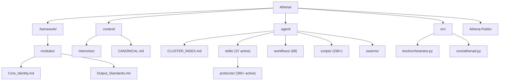

# Athena Workspace Architecture

> **Last Updated**: 30 May 2026  
> **System Version**: v9.9.0
> **Canonical Counts**: See `.agent/config/CAPS.json` — if numbers in this file diverge, CAPS wins.

> [!NOTE]
> This document describes the architecture of a **mature Athena workspace** — what your installation grows into over time. The public repository ([Athena-Public](https://github.com/winstonkoh87/Athena-Public)) ships with a starter subset: 155+ example protocols, 135+ reference scripts, and templates. As you use Athena, your workspace compounds toward the full architecture described here.

---

## Directory Structure

```text
Athena/
├── .framework/                    # ← THE CODEX (stable, rarely updated)
│   ├── v8.2-stable/               # Current stable modules directory
│   │   ├── modules/
│   │   │   ├── Core_Identity.md   # Laws #0-#6, RSI, Bionic Stack, COS
│   │   │   └── Output_Standards.md # Response formatting, reasoning levels
│   │   ├── protocols/             # Versioned protocol copies
│   │   └── templates/             # Core templates
│   └── archive/                   # Archived monoliths (v7 / v8.0 / v8.1)
│
├── .context/                      # ← USER-SPECIFIC DATA (frequently updated)
│   ├── memories/
│   │   ├── case_studies/          # 458+ documented patterns (15 domains)
│   │   ├── session_logs/          # Historical session analysis
│   │   └── patterns/              # Formalized patterns
│   ├── memory_bank/               # Boot files (activeContext, userContext, etc.)
│   ├── CANONICAL.md               # Canonical memory (compacted truths)
│   ├── PROJECTS.md                # Active project switchboard
│   ├── PROTOCOL_SUMMARIES.md      # All-protocol quick-lookup
│   ├── PROTOCOL_HEATMAP.md        # Protocol usage frequency
│   ├── KNOWLEDGE_GRAPH.md         # Concept relationships
│   ├── TECH_DEBT.md               # Technical debt tracker
│   └── CASE_STUDY_INDEX.md        # Case study domain taxonomy
│
├── .agent/                        # ← AGENT CONFIGURATION
│   ├── CLUSTER_INDEX.md           # 15 cognitive clusters (routing map)
│   ├── WORKFLOW_INDEX.md          # Workflow registry
│   ├── skills/
│   │   ├── protocols/             # 395+ active protocols across 34 categories
│   │   │   ├── architecture/      # System protocols
│   │   │   ├── business/          # Business frameworks
│   │   │   ├── coding/            # Development standards
│   │   │   ├── decision/          # Decision frameworks (EEV, GTO, MCDA)
│   │   │   └── ... (+30 more)     # engineering, marketing, reasoning, etc.
│   │   └── [37 active skills]     # Self-contained executables with context_trigger
│   ├── workflows/                 # 68 slash commands (51 root + 17 _domain)
│   ├── scripts/                   # 258+ Python automation scripts
│   ├── swarms/                    # Multi-agent swarm definitions
│   ├── config/                    # CAPS.json, manifests
│   └── archive_skills/            # 16 sunset skills (read-only)
│
├── src/                           # ← PYTHON SDK SOURCE
│   └── athena/
│       ├── boot/                  # Boot pipeline (orchestrator.py)
│       ├── core/                  # Runtime (athenad.py, health.py)
│       └── tools/                 # SDK tools (search.py)
│
├── tests/                         # Test suite
├── supabase/                      # Cloud vector store migrations
│
├── Athena-Public/                 # ← PUBLIC PORTFOLIO (sibling repo)
│   ├── docs/                      # This documentation
│   ├── examples/                  # Protocols, scripts, templates, skills
│   ├── src/                       # Public SDK source
│   └── README.md                  # Repository overview
│
└── docs/                          # Root-level docs (private)
```

### Visual Overview



---

## Operating Philosophy: EEV-First Optimization

> **Core Principle**: Athena optimizes for **Economic Expected Value (EEV)**, not Mathematical Expected Value (MEV). This is the single most consequential design decision in the system.

**Why**: The user operates in a **non-ergodic** environment — solo operator, finite bankroll, absorbing barriers exist (bankruptcy, reputation damage, client loss). MEV is only valid when losses are recoverable and the game repeats infinitely. For a single agent walking a single path through time, EEV is the correct optimization target.

| Framework | Optimizes For | Valid When | Athena Default |
|:---|:---|:---|:---|
| **MEV** (Mathematical EV) | Expected dollar return across infinite trials | Ergodic: no absorbing barriers, losses recoverable | ❌ Not default |
| **EEV** (Economic EV) | Expected change in life quality, survival-weighted | Non-ergodic: absorbing barriers exist | ✅ **Default** |

**When Athena deviates to MEV**: Only in explicitly ergodic contexts — e.g., evaluating a VC portfolio with 50+ bets, or analyzing a casino's edge. The ergodicity classification is performed via the P(Survive N trials) diagnostic: if survival probability drops below 80% over realistic N, MEV analysis is vetoed.

**In practice, this means**:
- **Pricing**: Price high to preserve margin of survival, not low to maximize volume
- **Trading**: Half-Kelly maximum position sizing; survival first, returns second
- **Opportunities**: Reject +MEV opportunities that carry >5% ruin probability, regardless of expected value

> **Full Framework**: [Protocol 330: Economic Expected Value](../examples/protocols/decision/330-economic-expected-value.md) · [Protocol 193: Ergodicity Check](../examples/protocols/decision/193-ergodicity-check.md) · [Protocol 500: GTO Problem Solver](../examples/protocols/decision/500-gto-problem-solver.md)

---

## Operating Philosophy: Symbiotic RSI

> **Core Principle**: Intelligence compounds at the **interface** between human judgment and AI reasoning — not unilaterally within either.

**Why**: Unilateral AI self-improvement (the AI rewriting its own code) is a *closed system* — it can only rearrange existing information. Symbiotic RSI is an *open system*: the human injects genuinely new information (taste, correction, lived experience, domain knowledge) that the AI cannot generate internally, while the AI provides perfect recall, structural discipline, and pattern-matching at scale. The moat is not the code — it's the **coupling data** from 1,800+ sessions of bilateral calibration.

| Dimension | Unilateral AI RSI | Symbiotic RSI (Athena) |
|:----------|:------------------|:-----------------------|
| **Who improves?** | AI alone (autonomous) | Human + AI together (bilateral) |
| **Energy source** | Internal (closed system) | External — human judgment (open system) |
| **Current status** | Hypothetical | **Working today** (1,800+ sessions) |
| **Moat** | Compute (replicable) | Coupling data (unreplicable without living it) |

**In practice**:
- **Session 1**: Marginally better than vanilla ChatGPT
- **Session 100**: Noticeably different — anticipates patterns, applies learned frameworks
- **Session 1,000+**: Qualitatively different system — thinks in your frameworks before you state them

> **Full Framework**: [Symbiotic RSI](USER_DRIVEN_RSI.md) — The bilateral loop, dual helix model, thermodynamic framing, and moat analysis

---

## Cognitive Stack — Perception Model (v9.9.0)

> Modeled after human sensory processing: **Parallel Activation → Attention Gate → Executive Function → Response**.
> The brain doesn't classify-then-route; it activates-then-filters. Athena's runtime works the same way.

```
                    ┌─────────────────────────────────────────┐
  Prompt ──────────▶│  ① TRANSDUCTION (Parallel Activation)   │
  (Stimulus)        │  ├── Semantic Memory    (CANONICAL, KB) │
                    │  ├── Episodic Memory    (Session Logs)  │
                    │  ├── Procedural Memory  (Skills/Protos) │
                    │  └── Contextual Memory  (activeContext) │
                    │  8 channels fire simultaneously via RRF │
                    └──────────────┬──────────────────────────┘
                                   │ raw activations
                                   ▼
                    ┌─────────────────────────────────────────┐
                    │  ② ATTENTION GATE (Relevance Filter)    │
                    │  ├── Top-down: Prior context narrows    │
                    │  ├── Bottom-up: Novel/high-signal wins  │
                    │  ├── Threshold: Only > threshold passes │
                    │  └── Progressive Disclosure (Tier 1→2→3)│
                    └──────────────┬──────────────────────────┘
                                   │↑ bidirectional feedback
                                   ▼
                    ┌─────────────────────────────────────────┐
                    │  ③ EXECUTIVE FUNCTION (Decision Layer)  │
                    │  ├── Risk Gate    (Law #1 — No Ruin)    │
                    │  ├── Inhibition   (Circuit Breaker)     │
                    │  ├── Planning     (Working Memory)      │
                    │  └── Calibration  (Λ Score → depth)     │
                    └──────────────┬──────────────────────────┘
                                   │
                                   ▼
                              Response (Action)
```

### How Each Stage Maps to Athena

| Stage | Human Analog | Athena Implementation |
|:------|:-------------|:----------------------|
| **① Transduction** | Sensory receptors fire simultaneously | `search.py` fires 8 parallel channels: Canonical, Vectors, GraphRAG, SQLite, Tags, Filenames, Framework, Exocortex |
| **② Attention Gate** | Thalamus filters — only relevant signals reach cortex | Weighted RRF fusion (k=60) + confidence threshold + progressive disclosure tiers |
| **③ Executive Function** | Prefrontal cortex — plan, inhibit, decide | Λ score calibrates depth; Law #1 gates ruin; Circuit Breaker inhibits; Red Team reviews |
| **Response** | Motor cortex — act | Agent generates output, files checkpoints, updates context |

### Why Not a Waterfall?

The previous architecture (`Intent → System → Cluster → Skill → Protocol`) assumed a waterfall: classify first, then route. This fails because:

1. **Classification errors cascade** — misclassify intent and the entire chain fires wrong
2. **No feedback** — once classified, there's no mechanism to re-evaluate
3. **Memory is gated by labels** — trading knowledge is invisible during a "psychology" query, even when it's relevant (e.g., emotional variance = psychology AND trading)

The Perception Model fixes all three: everything activates in parallel, relevance emerges from the data, and feedback loops allow course-correction mid-processing.

### Cognitive Domains (Memory Activation Targets)

These are **not routing stages** — they're the memory domains that activate during transduction. The prompt doesn't get classified into one; relevant memories from ALL domains surface simultaneously.

| Priority | Domain | Archetype | Key Skills |
|:---------|:-------|:----------|:-----------|
| 1 | 🛡️ Survival | Crisis / ruin prevention | `circuit-breaker`, `bionic-safety-net` |
| 2 | 🫀 Life Decision | Irreversible personal choice | `bionic-decision-engine`, `red-team-review` |
| 3 | 📈 Trading | Capital deployment | `trading-risk-gate`, `zenith-execution`, `trade-journal-analyzer` |
| 4 | 🤝 Social | Interpersonal dynamics | `power-inversion`, `consiglieri-protocol` |
| 5 | ⚙️ Execution | Build / ship / create | `agentic-code-orchestrator`, `spec-driven-dev`, `micro-commit` |
| 6 | 📣 Growth | Distribution / audience | `sovereign-economics-engine`, `distribution-physics`, `seo-auditor` |
| 7 | 📖 Learning | Understanding / knowledge | `deep-research-loop`, `semantic-search` |
| 8 | 🔄 Maintenance | System homeostasis | `context-compactor`, `daemon-loop` |

**Priority does NOT mean "route here first"** — it means "if multiple domains activate with equal signal strength, the higher-priority domain's memories take precedence in the attention gate." Survival always wins ties. This is the amygdala hijack analog.

### Cluster Map (Procedural Memory Index)

Clusters represent bundles of procedural knowledge that co-activate. When the attention gate passes a trading-related signal, clusters #3-5 activate as a unit, not sequentially.

| # | Cluster | Capstone Skill | Domain |
|:--|:--------|:---------------|:-------|
| 1 | Diagnostic Engine | P501 | Decision |
| 2 | Context Lifecycle | P502 | Architecture |
| 3 | Trading Risk Gate | `trading-risk-gate` | Trading |
| 4 | Trading Execution | `zenith-execution` | Trading |
| 5 | Trade Analytics | `trade-journal-analyzer` | Trading |
| 6 | Social Contract | `power-inversion` + `consiglieri-protocol` | Business/Social |
| 7 | Inner Work | `therapeutic-ifs` | Psychology |
| 8 | Adversarial QA | `red-team-review` | Quality |
| 9 | Strategic Reasoning | `bionic-decision-engine` | Decision |
| 10 | Distribution Engine | `sovereign-economics-engine` | Marketing |
| 11 | Swarm Orchestrator | `marketing-swarm` + `git-worktree-swarm` | Architecture |
| 12 | Research Pipeline | `deep-research-loop` + `semantic-search` | Research |
| 13 | Build Lifecycle | `agentic-code-orchestrator` | Engineering |
| 14 | Sovereign Safety | `bionic-safety-net` | Safety |
| 15 | Problem-Solving Engine | P504 + P115 + P505 + P506 + `red-team-review` | Reasoning |

### Inventory

| Layer | Count | Description |
|:------|------:|:------------|
| Cognitive Domains | 8 | Memory activation targets (priority-ordered for tie-breaking) |
| Cognitive Clusters | 15 | Co-activating procedural memory bundles |
| Skills | 37 active (16 archived) | Self-contained executables; context_trigger auto-activation |
| Protocols | 395 active (32 archived; 427 total) | Atomic reusable procedures (.md); uncapped |
| Workflows | 68 (51 root + 17 `_domain/`) | User-facing slash commands; domain tier conditionally activated |

### Uber-Skills (Umbrella Consolidations)

Five dense umbrella skills retroactively compiled from 1800+ sessions. These absorb multiple existing skills/protocols and auto-trigger on broad domain keywords:

| Skill | Absorbs | Activates On |
|:------|:--------|:-------------|
| `bionic-decision-engine` | 46 decision + 24 strategy protocols | Any "Should I?" question, tradeoffs, resource allocation |
| `sovereign-economics-engine` | client-pricing + distribution-physics + brand-foundations + seo-auditor | Client, pricing, business model, distribution |
| `agentic-code-orchestrator` | data-analysis + academic-delivery + spec-driven-dev + statistical-analysis | Code, refactor, data dump, dashboard |
| `bionic-safety-net` | circuit-breaker | Health, finance, burnout, ruin, emergency |
| `structural-trading-gate` | trading-risk-gate + zenith-execution + trade-journal-analyzer | Trading, poker, sizing, bankroll, drawdown |

---

## Boot Sequence

```
/start → ~10K tokens, <5s
```

1. Load core identity (Laws #0–#6) — **primes top-down context** for attention gate
2. Load memory bank (userContext, productContext, activeContext) — **seeds episodic memory**
3. Run `boot.py` (session recall, semantic prime, daemon health check, COS init)
4. JIT activation replaces static routing — Protocol 530 (conditional skill loading) activates relevant procedural memory on demand

### Loading Strategy (Progressive Disclosure)

| Layer | Trigger | Tokens |
|:------|:--------|-------:|
| Core Identity | `/start` | ~2K |
| Memory Bank (3 files) | `/start` | ~3.5K |
| Boot orchestrator | `/start` | ~2K |
| CANONICAL Tier 1 (always boot) | `/start` | ~16K (29 entries) |
| CANONICAL Tier 2 (domain-triggered) | Query match | ~41K (140 entries, loaded on demand) |
| Protocol (on-demand) | Attention gate pass | ~3-7K each |
| Skill cluster (on-demand) | `context_trigger` match | ~5-15K per cluster |
| Full context | `/fullload` | ~28K |

### Boot Resilience

The boot stack has a deliberate two-layer architecture:

| Layer | File | Dependencies | Purpose |
|:---|:---|:---|:---|
| **Shim** | `.agent/scripts/boot.py` | Python stdlib only | If the SDK is corrupted, this still runs and offers a recovery shell |
| **Orchestrator** | `src/athena/boot/orchestrator.py` | Full SDK | The real boot pipeline — parallel loading, health checks, sidecar launch |

If the orchestrator fails to import, `boot.py` catches the `ImportError` and drops into a recovery menu.

---

## Retrieval Stack

```
src/athena/tools/search.py (12s God Mode timeout + grep fallback)
├── Full SDK search (parallel hybrid RRF + semantic cache)
│   ├── Canonical search (CANONICAL.md keyword matching, min 2-hit)
│   ├── Tag search (grep against TAG_INDEX shards)
│   ├── Vector search (Supabase pgvector, 11 parallel RPCs, threshold ≥0.3)
│   ├── GraphRAG search (entity + community matching, --global-only)
│   ├── Filename search (find across project root, keyword OR logic)
│   ├── Framework docs search (keyword matching in .framework/ + memory_bank/)
│   ├── SQLite search (local athena.db — files + tags)
│   └── Exocortex search (Wikipedia FTS5)
├── Fusion: Weighted RRF (k=60, per-type weights, dynamic score modifiers)
├── Telemetry: retrieval_log.jsonl (quality: hit/partial/miss, source distribution)
└── Grep fallback (runs if full search times out)
    ├── CANONICAL.md
    ├── PROTOCOL_SUMMARIES.md
    ├── Session log filenames
    └── Memory bank files
```

---

## Risk-Proportional Response (Law #6)

| Level | Λ Score | Protocol | Latency |
|:------|--------:|:---------|--------:|
| SNIPER | < 10 | Direct answer. Search exempt. | ~1s |
| STANDARD | 10-30 | Triple-Lock (Search → Save → Speak) | ~5-10s |
| ULTRA | > 30 | Triple-Lock + Triple Crown reasoning | Unbounded |

---

## The Daemon Layer

### athenad.py — The Active OS Kernel

`athenad` is a persistent background process that runs independently of conversation sessions. It monitors the workspace for file changes and keeps metadata synchronized.

**Key Behaviors:**

| Component | Responsibility |
|:---|:---|
| **File System Watcher** | Polls `.agent/` and `.context/` every 5 seconds. Uses checksum comparison. |
| **SQLite Metadata** | Tracks file checksums, last-modified times, and indexing status. |
| **Tag Extractor** | Parses `#hashtag` lines from Markdown files for the tag system. |
| **Rotating Logs** | `athenad.log` — 5MB max × 3 backups. |

---

## Swarm Execution

### Protocol 416: Parallel Agent Orchestration

For tasks that can be parallelized, Athena spawns multiple agents using **git worktrees** — each agent gets an isolated working copy of the codebase.

| Phase | Action | Tool |
|:---|:---|:---|
| **Split** | Create isolated git worktrees per agent | `worktrunk.py add <name>` |
| **Build** | Each agent works in parallel on its task | Independent terminals/IDEs |
| **Converge** | Merge worktree branches back to main | `worktrunk.py merge <name>` |

**Performance**: 3 agents working in parallel reduce a 5-hour linear task to ~2 hours.

---

## MCP Server

```
src/athena/mcp_server.py (FastMCP v3.x, stdio transport)
├── smart_search      — Hybrid RAG search (read, memory)
├── agentic_search    — Multi-step query decomposition (read, admin)
├── quicksave         — Session checkpoint with Triple-Lock governance
├── health_check      — Vector API + Database subsystem audit
├── recall_session    — Retrieve recent session log content
├── governance_status — Triple-Lock compliance state
├── list_memory_paths — Active memory directory inventory
├── set_secret_mode   — Toggle demo/external redaction mode
├── permission_status — Current permission + tool manifest
└── Resources:
    ├── athena://session/current  — Full current session log
    └── athena://memory/canonical — CANONICAL.md content
```

---

## Lifecycle Hooks

Hooks are **deterministic scripts** that run outside the agentic loop on specific lifecycle events. Unlike protocols (which are reasoning templates), hooks are code — they execute unconditionally.

```text
Event                  Hook                          Maps To
─────────────────────  ────────────────────────       ──────────────────────
on_session_start       quicksave.py (checkpoint)      /start workflow
on_session_end         quicksave.py (final save)      /end workflow
pre_tool_use           ruin_check.py                  Law #1 (No Ruin)
                       trading_gate.py                Cluster #3
                       public_repo_guard.py           /deploy workflow
post_tool_use          asset_logger.py                Session inventory
pre_compact            pre_compact.py                 Context lifecycle
on_error               circuit_breaker.py             Protocol 514
on_task_complete       reflexion_check.py             Protocol 515
```

---

## Orchestration Pattern

When a user invokes a slash command, the runtime follows a 3-layer orchestration:

```text
┌─────────────────────────────────────────────────┐
│  Layer 1: WORKFLOW (Entry Point)                │
│  User invokes /plan, /research, /vibe, etc.     │
│  → Defines the macro-level sequence             │
│  → Lives in .agent/workflows/*.md               │
├─────────────────────────────────────────────────┤
│  Layer 2: SKILL (Domain Bundle)                 │
│  Workflow activates relevant skill(s)           │
│  → Bundles 2-5 protocols into a domain unit     │
│  → Lives in .agent/skills/*/SKILL.md            │
│  → Progressive disclosure (loaded JIT)          │
├─────────────────────────────────────────────────┤
│  Layer 3: PROTOCOL (Atomic Procedure)           │
│  Skill activates specific protocol(s)           │
│  → Single-purpose, composable, ~200 tokens      │
│  → Lives in .agent/skills/protocols/**/*.md     │
│  → 395+ active protocols across 34 domains      │
└─────────────────────────────────────────────────┘
```

**Key Design Rule**: Each layer can only invoke the layer below it, never sideways or upward. A protocol cannot invoke a workflow. A skill cannot invoke another skill. This prevents circular dependencies and keeps the stack debuggable.

---

## Design Principle: Modular > Monolith

> **Core thesis**: AI agents don't read files sequentially — they **query** them. A workspace optimized for agents should be a **graph of small, addressable nodes**, not a monolithic document.

### The Five Advantages

| # | Principle | Monolith | Modular |
|:-:|:----------|:---------|:--------|
| 1 | **Context Efficiency** | Loads 50K tokens even when 200 are relevant | Loads only the files the query demands (JIT) |
| 2 | **Addressability** | "See page 47" — no agent can do this | `CS-378-prompt-arbitrage.md` — retrievable by name, tag, or semantic search |
| 3 | **Zero Coupling** | Editing marketing section risks breaking trading rules | Each file is independent — change one, break nothing |
| 4 | **Version Control** | One-line change → 50K-token diff | Atomic commits per file with clean history |
| 5 | **Composability** | Can't mix-and-match sections at runtime | Swarms, workflows, and skills load as independent Lego bricks |

### Human UX vs Agent UX

| Dimension | Human | AI Agent |
|:----------|:------|:---------|
| **Navigation** | Read sequentially (top → bottom) | Query by filename, tag, or embedding similarity |
| **"Organized" feels like** | One well-structured document | Many small, well-named files |
| **Index** | Table of contents | File system + PROTOCOL_SUMMARIES + vector embeddings |
| **Retrieval** | Ctrl+F / scroll | Semantic search + RRF fusion |

> *The workspace is not a codebase. It's an **exocortex** — a knowledge graph stored as flat files, navigable by any agent that can read Markdown.*

---

## The Exocortex Model

> **Concept**: Athena is not just a coding assistant. It is a **Centralised HQ** for your entire life — a "second brain" that manages external domains (Work, Wealth, Health) from a single command center.

### Mount Points

To enable Athena to manage your life, you define **Mount Points** — aliases to external folders that exist *outside* the Athena directory:

```python
# In src/athena/boot/constants.py
MOUNTS = {
    "WORK": "/Users/you/Desktop/Assignments",
    "WEALTH": "/Users/you/Desktop/Wealth",
    "HEALTH": "/Users/you/Desktop/Health"
}
```

This separation protects your user data from system updates. If Athena's code is reset, your Health records remain safe in their own folder.

---

## Key Files Reference

| Purpose | File | Update Frequency |
|:---|:---|:---|
| Who I am | `Core_Identity.md` | Rare |
| How to respond | `Output_Standards.md` | Moderate |
| Who the user is | `User_Profile.md` | Every session |
| Architecture SSOT | This file | When architecture changes |
| Available skills | `SKILL_INDEX.md` | When skills added |
| Routing index | `CLUSTER_INDEX.md` | When clusters change |
| Session history | `session_logs/*.md` | Every session |

---

## Tech Stack

| Component | Technology |
|:---|:---|
| **AI Engine** | Model-agnostic (Gemini, Claude, GPT, Grok — any LLM via agentic IDE) |
| **IDE Integration** | Antigravity / Cursor / Claude Code / VS Code + Copilot / Gemini CLI |
| **Knowledge Store** | Markdown + VectorRAG (Supabase + pgvector) |
| **Daemon** | Python (athenad.py) + SQLite |
| **Version Control** | Git |
| **Scripting** | Python 3.13 |

---

## Metrics (30 May 2026)

| Metric | Count |
|:-------|------:|
| Protocols (active) | 395 |
| Protocols (archived) | 32 |
| Skills (active) | 37 (conditional) |
| Uber-Skills | 6 |
| Cognitive Clusters | 15 |
| Cognitive Domains | 8 |
| Workflows | 68 (51 root + 17 domain) |
| Automation Scripts | 258 |
| Case Studies | 458 (15 domains) |
| Session Logs | 1,800+ |
| Source Files (SDK) | 72 |
| Test Files | 34 |
| Documentation Files | 76 |
| Active Indexes | 4 (63KB) |
| CANONICAL Entries | ~400 (29 Tier 1, 140 Tier 2, 3 Tier 3) |
| Cap Policy | Uncapped (attention budget constraint via Protocol 530) |

---

## Version History

| Version | Date | Changes |
|:---|:---|:---|
| v9.9.0 | 30 May 2026 | **Architecture Model Sync** — Replaced waterfall routing with Perception Model (parallel activation → attention gate → executive function). Added 8 Uber-Skills to public repo. Privacy remediation (18 files scrubbed, post-sync gate added). Skills 27→35 in public repo. |
| v9.8.8 | 12 May 2026 | Model Version Sync — Claude Opus 4.6→4.7, GPT-5.4→5.5 across all public surfaces. Provenance Standard added to CANONICAL.md. |
| v9.8.7 | 11 May 2026 | Hermes Agent Steal — `skill-compiler` (automated solved-to-skill compiler from NousResearch/hermes-agent), curator lifecycle model. |
| v9.8.6 | 11 May 2026 | Infrastructure Hardening — ENG-542 GateGuard, QUA-541 De-Sloppify, Progressive Disclosure (TD-021) for 66KB boot savings, External Verification Mandate. |
| v9.8.5 | 08 May 2026 | MinMax Token Economy — operational doctrine shift from Maximum Compute to Token Economy. |
| v9.8.4 | 01 May 2026 | GTO Metrics Sync — Meta-Pattern Framework v2.0, filesystem-verified counts. |
| v9.8.3 | 19 Apr 2026 | Synaptic Pruning — Protocol deduplication (395→378 active), Case Study deduplication. |
| v9.8.2 | 17 Apr 2026 | Progressive Disclosure (Protocol 530 full rollout), Telemetry Foundation, Auto-Gen Indexes. |
| v9.8.1 | 17 Apr 2026 | Mechanical Enforcement — DISCIPLINE.md v2 (human rules → pre-commit gates). |
| v9.8.0 | 17 Apr 2026 | Security Hardening (RLS vector tables), Protocol Domain-Prefix Naming (131 renames), CI Quality Gate. |
| v9.7.0 | 10 Apr 2026 | Biological Analogy v2 (7-tier stack), GTO Metrics Sync. |
| v9.6.2 | 26 Mar 2026 | `/ultrastart` + `/ultraend` GTO Upgrade. |
| v9.5.x | Mar 2026 | MinMax, Deep Audit, Maximum Compute, Architecture Integrity. |
| v9.4.x | Mar 2026 | Cognitive Architecture v2.x, Daemon cleanup, Bio Stack Architecture. |
| v9.3.x | Feb-Mar 2026 | EEV v3.0, README audit, GTO formalization. |
| v8.x | Jan 2026 | Zero-Point Refactor, Sovereign Environment, Score-Modulated RRF. |
| v7.x | Dec 2025 | VectorRAG migration, 140+ protocols, Antigravity migration. |
| v6.x | Nov 2025 | Initial modular architecture. |

---

## See Also

- **[Symbiotic RSI](USER_DRIVEN_RSI.md)** — The bilateral loop: how you and AI improve together
- **[Glossary](GLOSSARY.md)** — Key terms and definitions
- **[Getting Started](GETTING_STARTED.md)** — Installation and setup guide
- **[Your First Session](YOUR_FIRST_SESSION.md)** — Step-by-step tutorial

---

## About the Author

Built by **Winston Koh** — 10+ years in financial services, now building AI systems.

→ **[About Me](ABOUT_ME.md)** | **[GitHub](https://github.com/winstonkoh87)** | **[LinkedIn](https://www.linkedin.com/in/winstonkoh87/)**
