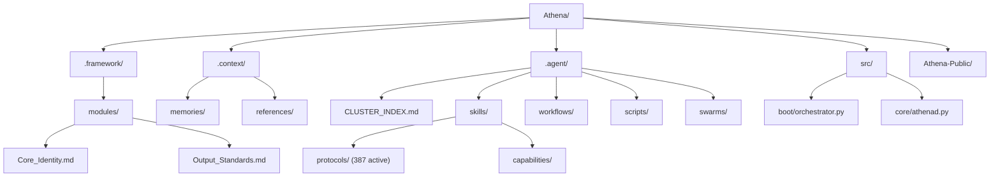
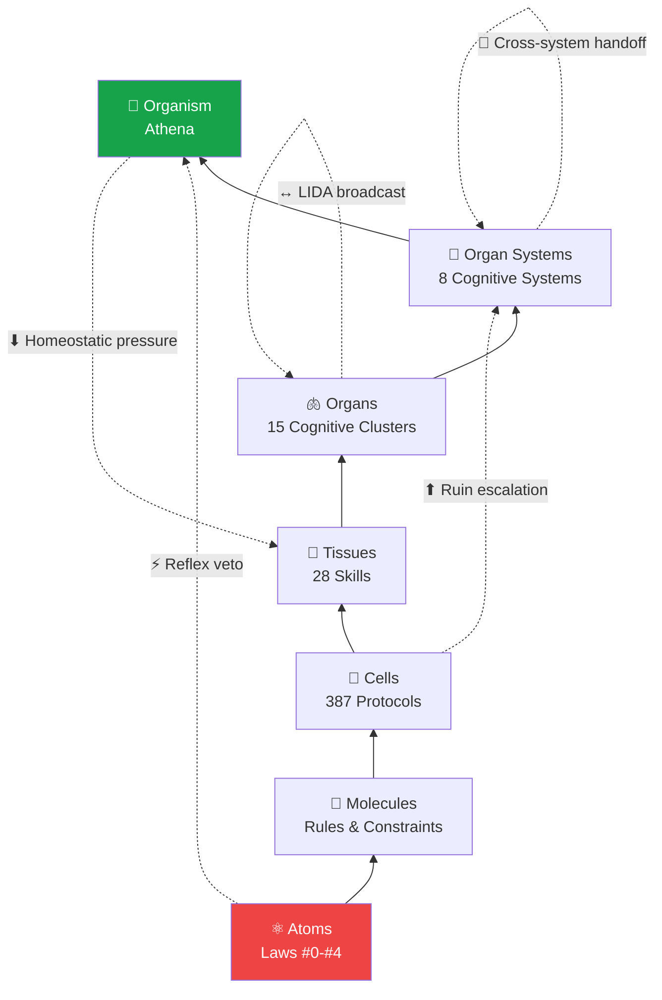
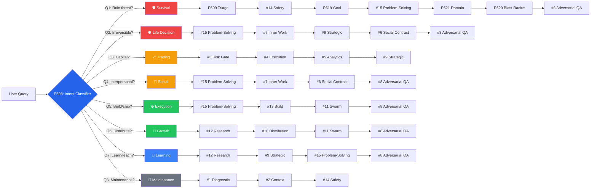
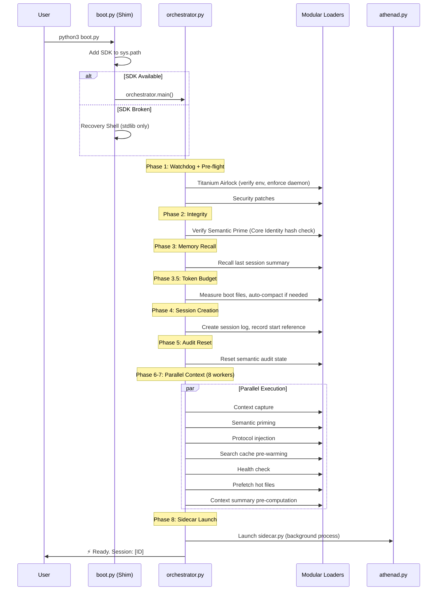
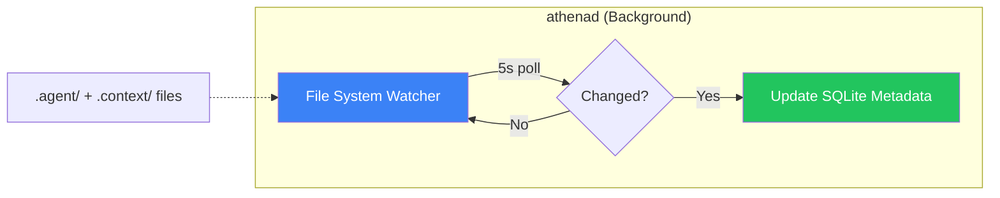
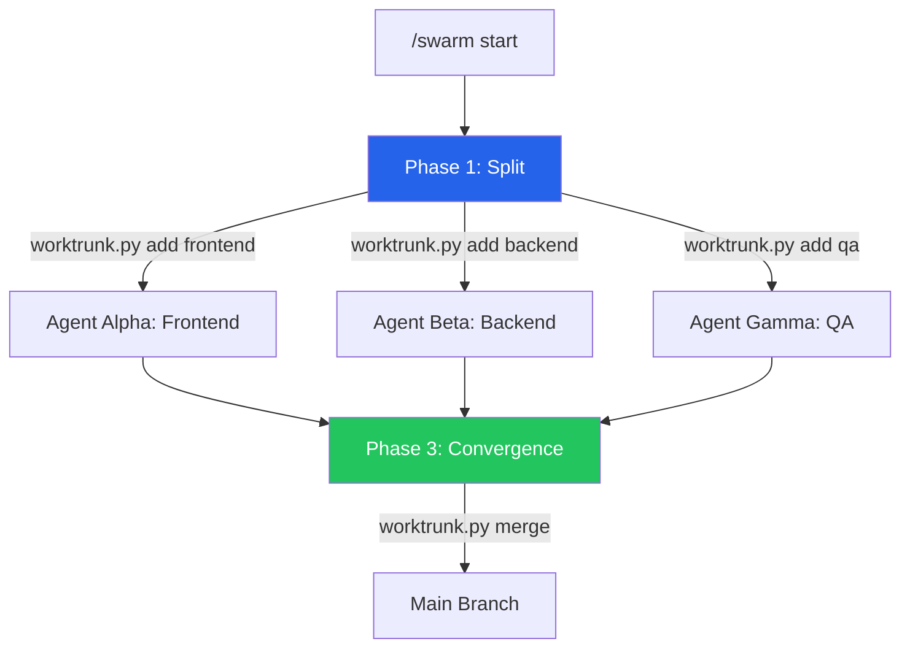
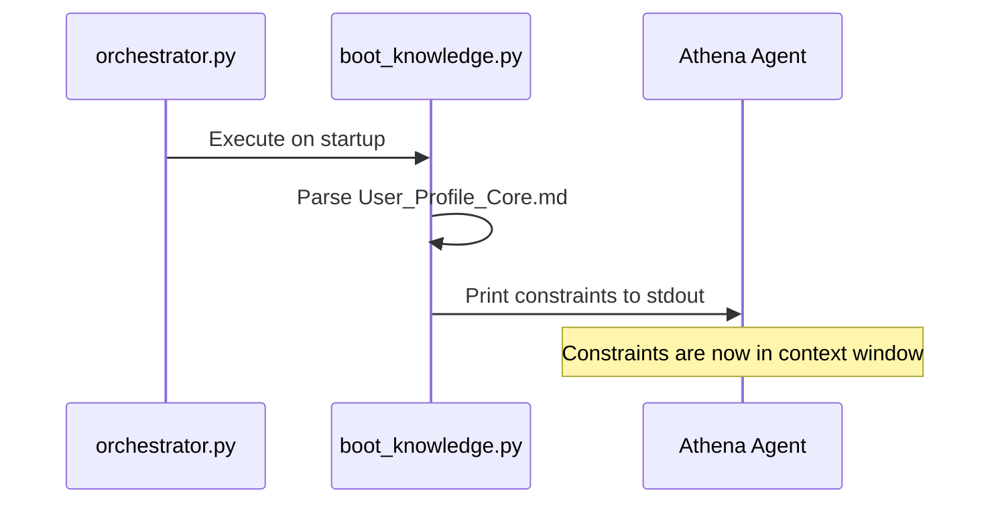
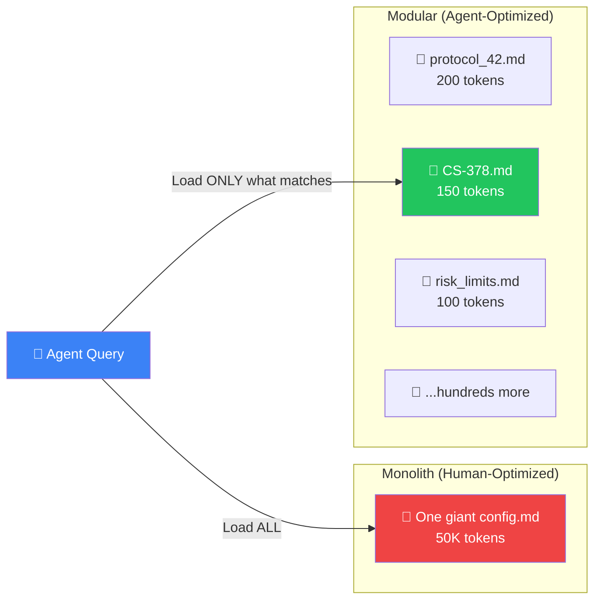
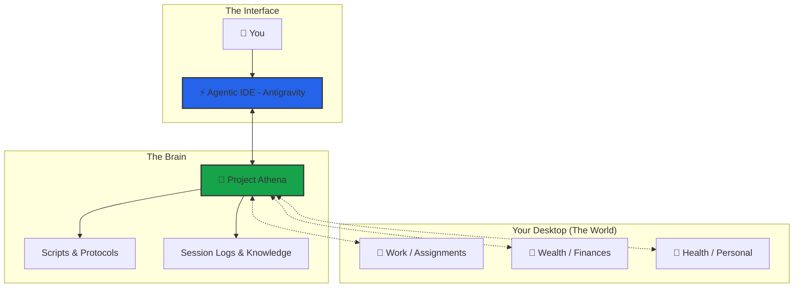

# Athena Workspace Architecture

> **Last Updated**: 9 May 2026  
> **System Version**: v9.8.6

> [!NOTE]
> This document describes the architecture of a **mature Athena workspace** — what your installation grows into over time. The public repository ([Athena-Public](https://github.com/winstonkoh87/Athena-Public)) ships with a starter subset: 149+ example protocols, 130+ reference scripts, and templates. As you use Athena, your workspace compounds toward the full architecture described here.

---

## Directory Structure

```text
Athena/
├── .framework/                    # ← THE CODEX (stable, rarely updated)
│   ├── v8.2-stable/               # Current stable modules directory
│   │   ├── modules/
│   │   │   ├── Core_Identity.md   # Laws #0-#4, RSI, Bionic Stack, COS
│   │   │   └── Output_Standards.md # Response formatting, reasoning levels
│   │   ├── protocols/             # Versioned protocol copies
│   │   └── templates/             # Core templates
│   └── archive/                   # Archived monoliths
│
├── .context/                      # ← USER-SPECIFIC DATA (frequently updated)
│   ├── User_Vault/                # Personal vault (credentials, secrets)
│   ├── memories/
│   │   ├── case_studies/          # 443+ documented patterns
│   │   ├── session_logs/          # Historical session analysis
│   │   └── patterns/              # Formalized patterns
│   ├── references/                # External frameworks (Dalio, Halbert, Graham)
│   ├── research/                  # Steal analyses, explorations
│   ├── TAG_INDEX_A-M.md           # Global hashtag system (split for performance)
│   ├── TAG_INDEX_N-Z.md
│   └── KNOWLEDGE_GRAPH.md         # Visual architecture reference
│
├── .agent/                        # ← AGENT CONFIGURATION
│   ├── CLUSTER_INDEX.md           # Routing index: Systems → Clusters → Skills
│   ├── skills/
│   │   ├── SKILL_INDEX.md         # Protocol loading registry
│   │   ├── protocols/             # 387 active protocols across 35 domains (32 archived)
│   │   │   ├── architecture/      # System protocols (latency, modularity)
│   │   │   ├── business/          # Business frameworks
│   │   │   ├── coding/            # Development standards
│   │   │   ├── decision/          # Decision frameworks (EEV, GTO, MCDA)
│   │   │   ├── engineering/       # Engineering practices
│   │   │   ├── marketing/         # Marketing & distribution
│   │   │   ├── memory/            # Memory compression & retrieval
│   │   │   ├── meta/              # Meta-protocols (Red Team, Zero-Point)
│   │   │   ├── psychology/        # Psych protocols
│   │   │   ├── reasoning/         # Reasoning frameworks
│   │   │   ├── safety/            # Safety & risk protocols
│   │   │   ├── strategy/          # Strategy frameworks
│   │   │   ├── trading/           # Trading protocols
│   │   │   ├── verification/      # Verification & QA
│   │   │   └── ... (+20 more)     # workflow, research, health, etc.
│   │   └── capabilities/          # Bionic Triple Crown
│   ├── workflows/                 # 73+ slash commands
│   │   ├── start.md               # Session boot
│   │   ├── end.md                 # Session close + maintenance
│   │   ├── think.md               # Deep reasoning (L4)
│   │   └── ...
│   ├── scripts/                   # 220+ Python automation scripts
│   │   ├── boot.py                # Resilient boot shim + recovery shell
│   │   ├── quicksave.py           # Auto-checkpoint every exchange
│   │   ├── smart_search.py        # Semantic search (hybrid RAG)
│   │   ├── sidecar.py             # Sovereign index process
│   │   └── ...
│   ├── swarms/                    # Multi-agent orchestration
│   │   └── marketing_team/        # 16-agent marketing swarm
│   └── gateway/                   # Sidecar process for persistence
│
├── src/                           # ← PYTHON SDK SOURCE
│   └── athena/
│       ├── boot/                  # Boot pipeline
│       │   ├── orchestrator.py    # 8-phase parallel boot sequence
│       │   ├── loaders/           # Modular loaders (UI, State, Identity, Memory, System)
│       │   └── constants.py       # Colors, paths, mount points
│       ├── core/                  # Core runtime
│       │   ├── athenad.py         # Daemon: file watcher + LightRAG indexer
│       │   ├── health.py          # System health checks
│       │   └── security.py        # Security patches
│       └── tools/                 # SDK tools
│
├── supabase/                      # ← VECTORRAG CONFIG
│   └── migrations/                # Database migrations
│
├── tests/                         # ← TEST SUITE
│
├── Athena-Public/                 # ← PUBLIC PORTFOLIO
│   ├── docs/                      # This documentation
│   ├── examples/                  # 150+ protocols, 163 scripts, templates
│   ├── src/                       # Public SDK source
│   ├── community/                 # Community resources
│   └── README.md                  # Repository overview
│
└── docs/                          # Root-level docs (private)
```

### Visual Overview



---

## Operating Philosophy: EEV-First Optimization

> **Core Principle**: Athena optimizes for **Economic Expected Value (EEV)**, not Mathematical Expected Value (MEV). This is the single most consequential design decision in the system.

**Why**: The user operates in a **non-ergodic** environment — solo operator, finite bankroll, absorbing barriers exist (bankruptcy, reputation damage, client loss). MEV is only valid when losses are recoverable and the game repeats infinitely. For a single agent walking a single path through time, EEV is the correct optimization target.

| Framework | Optimizes For | Valid When | Athena Default |
|:---|:---|:---|:---|
| **MEV** (Mathematical EV) | Expected dollar return across infinite trials | Ergodic: no absorbing barriers, losses recoverable | ❌ Not default |
| **EEV** (Economic EV) | Expected change in life quality, survival-weighted | Non-ergodic: absorbing barriers exist | ✅ **Default** |

**When Athena deviates to MEV**: Only in explicitly ergodic contexts — e.g., evaluating a VC portfolio with 50+ bets, or analyzing a casino's edge (the house *is* ergodic; the player is not). The ergodicity classification is performed via the [P(Survive N trials) diagnostic](../examples/protocols/decision/193-ergodicity-check.md): if survival probability drops below 80% over realistic N, MEV analysis is vetoed.

**In practice, this means**:
- **Pricing**: Price high to preserve margin of survival, not low to maximize volume
- **Trading**: Half-Kelly maximum position sizing; survival first, returns second
- **Opportunities**: Reject +MEV opportunities that carry >5% ruin probability, regardless of expected value

> **Full Framework**: [Protocol 330: Economic Expected Value](../examples/protocols/decision/330-economic-expected-value.md) · [Protocol 193: Ergodicity Check](../examples/protocols/decision/193-ergodicity-check.md) · [Protocol 500: GTO Problem Solver](../examples/protocols/decision/500-gto-problem-solver.md)

---

## Operating Philosophy: Symbiotic RSI

> **Core Principle**: Intelligence compounds at the **interface** between human judgment and AI reasoning — not unilaterally within either. Neither human nor AI can recursively self-improve alone.

**Why**: Unilateral AI self-improvement (the AI rewriting its own code) is a *closed system* — it can only rearrange existing information. Symbiotic RSI is an *open system*: the human injects genuinely new information (taste, correction, lived experience, domain knowledge) that the AI cannot generate internally, while the AI provides perfect recall, structural discipline, and pattern-matching at scale. The moat is not the code — it's the **coupling data** from 1,800+ sessions of bilateral calibration.

| Dimension | Unilateral AI RSI | Symbiotic RSI (Athena) |
|:----------|:------------------|:-----------------------|
| **Who improves?** | AI alone (autonomous) | Human + AI together (bilateral) |
| **Energy source** | Internal (closed system) | External — human judgment (open system) |
| **Current status** | Hypothetical (2126?) | **Working today** (1,800+ sessions) |
| **Moat** | Compute (replicable) | Coupling data (unreplicable without living it) |

**In practice, this means**:
- **Session 1**: Marginally better than vanilla ChatGPT
- **Session 100**: Noticeably different — anticipates patterns, applies learned frameworks
- **Session 1,000+**: Qualitatively different system — thinks in your frameworks before you state them

> **Full Framework**: [Symbiotic RSI](USER_DRIVEN_RSI.md) — The bilateral loop, dual helix model, thermodynamic framing, and moat analysis

---

## The Compositional Stack

> **Core Architecture**: Athena is built from atomic rules to a fully integrated synthetic intelligence — but the resulting topology is a **mesh**, not a ladder. Two complementary models describe the architecture: the **Compositional Hierarchy** (what the layers are) and the **Neuro-Cognitive Model** (how they govern).

### Compositional Hierarchy

> [!IMPORTANT]
> **This is not a linear stack.** The layers below describe *containment* (what's made of what), not *control flow*. In operation, signals travel in all directions: bottom-up (ruin escalation), top-down (Law #1 veto), laterally (LIDA broadcast across systems), and via feedback loops (homeostatic pressure). Think of it as a **biological neural network** — layered for description, networked in practice.



| Layer | Analogy | Athena Equivalent | Example |
|:---:|:---|:---|:---|
| 1 | **Atoms** | Laws #0-#4 | Law #1: No Ruin (absolute, non-negotiable) |
| 2 | **Molecules** | Rules & Constraints | "Never risk >5% of bankroll" (compound constraint) |
| 3 | **Cells** | 387 Protocols (32 archived) | Protocol 330: Economic Expected Value |
| 4 | **Tissues** | 28 Skills | `trading-risk-gate` (bundles 3 protocols) |
| 5 | **Organs** | 15 Cognitive Clusters | Cluster #3: Trading Risk Gate |
| 6 | **Organ Systems** | 8 Cognitive Systems | Trading System 📈 |
| 7 | **Organism** | Athena | The complete synthetic intelligence |

### Why Not a Ladder?

A real organism doesn't process information bottom-to-top. Neither does Athena. The 7 layers describe **containment** (protocols compose into skills, skills into clusters) — but at runtime, five non-linear signal types violate the ladder:

| Signal Type | Direction | Example | Ladder Equivalent |
|:---|:---|:---|:---|
| **Reflex Veto** | L1 → L7 (skip) | Law #1 fires, bypasses all intermediate layers | Spinal reflex — hand from fire before brain processes pain |
| **Ruin Escalation** | L3 → L6 (skip) | Any protocol detecting >5% ruin auto-escalates to Survival System | Pain signal jumping to motor cortex |
| **LIDA Broadcast** | L5 ↔ L5 (lateral) | Query triggers ≥2 Clusters — winner broadcasts to all for co-activation | Neural global workspace theory |
| **Cross-System Handoff** | L6 ↔ L6 (lateral) | Trading System hands off to Inner Work when emotional language detected | Cortical inter-lobe communication |
| **Homeostatic Pressure** | L7 → L4 (top-down) | Context saturation >80% triggers SNIPER mode, suppresses expensive skills | Hypothalamic downregulation |

The ladder is the **anatomy**. The mesh is the **physiology**. Both are real; only showing the ladder is misleading.

**Emergent Properties (Vertical):**

- Atoms → Molecules: Rules become *procedures* (sequence matters)
- Molecules → Cells: Procedures become *executable* (inputs/outputs defined)
- Cells → Tissues: Executables become *specialized* (domain-specific grouping)
- Tissues → Organs: Specializations become *co-activated* (cluster triggers)
- Organs → Organ Systems: Clusters become *orchestrated* (system-level routing)
- Organ Systems → Organism: Systems become *unified* (cross-system handoffs)

**Emergent Properties (Non-Linear):**

- Reflex bypasses reasoning: Safety doesn't wait for analysis
- Lateral broadcast creates awareness: Systems know what other systems are doing
- Feedback loops create homeostasis: The system self-regulates under resource pressure
- Skip connections create resilience: Low-level signals can override high-level plans

### The Neuro-Cognitive Model

> *A generic LLM is a brilliant amnesiac. Athena is the hippocampus.*

The compositional hierarchy describes *what* the layers are. The neuro-cognitive model describes *how they govern* — mapping Athena's architecture to the only biological system that enforces top-down governance, stores persistent context, and utilises hard-coded vetoes to prevent irreversible ruin: **the nervous system**.

| Neuroanatomy | Athena Component | Mechanism |
|:---|:---|:---|
| **Reflex Arc** (Spinal Cord) | Law #1 (No Irreversible Ruin) | Pre-computation veto. Bypasses higher-order reasoning to execute an immediate stop — like pulling a hand from fire. |
| **Motor Engram** (Cerebellum) | Protocol (`.md`) | A consolidated procedure. Executes a complex sequence reliably without recalculating from scratch each time. |
| **Neural Circuit** | Skill | A localised pathway dedicated to one specific function. |
| **Cortical Lobe** | Cognitive Cluster | A distinct brain region orchestrating multiple circuits for a specific domain. |
| **Hippocampus** | File System + VectorRAG | The indexer. Converts short-term experiences into long-term, retrievable memory. Platform memory (ChatGPT, Claude) functions like anterograde amnesia — able to converse in working memory but resetting completely when the session ends. Athena physically writes state to disk (long-term potentiation) and retrieves it to influence future reasoning. |
| **Prefrontal Cortex** | Athena (The OS) | Executive function. Applies top-down rules, suppresses impulsive outputs, and aligns actions with long-term goals. If the PFC is damaged, a human retains intelligence but loses impulse control and risk assessment — identical to an ungoverned LLM. |
| **Raw Neural Plasticity** | The LLM | The underlying computing substrate. Capable of vast pattern recognition, but inherently chaotic and hallucination-prone without governance. |

### The Hybrid Model

> Athena is neither a pure OS (fully deterministic) nor a pure organism (fully adaptive). It is an **OS kernel with a metabolic wrapper**.

The kernel (Laws, Protocols, Skills) is deterministic — strict adherence to protocol, no stochastic drift. But the wrapper layer introduces adaptive, quasi-biological mechanics:

| Biological Mechanism | Athena Equivalent | What It Does |
|:---|:---|:---|
| **Mutation** | Methodological arbitrage (stealing patterns from competitor systems) | Scouts external architectures and clones superior patterns |
| **Apoptosis** | Context compaction | Deliberately kills stale protocols and sessions when they're no longer useful |
| **Epigenetics** | Active Context layer | Modifies how protocols are *expressed* without changing the protocol source file |
| **Metabolism** | Nocturnal auto-consolidation | The system metabolises during shutdown — indexing, compacting, and pruning |
| **Homeostasis** | Synthetic hormone system (P517) | Resource-stress signals force mode downshift — the first feedback loop in the architecture |
| **Immune Memory** | Reflexion journaling (P515) | Stores failure lessons as retrievable antibodies — prevents recurring mistakes |
| **Hippocampal Paging** | Memory paging (P516) | Active page-in/page-out/pin/rewrite of working memory during domain transitions |
| **Forgetting Curve** | Ebbinghaus decay | Access-weighted decay on retrieval scores — unused memories fade, procedural patterns consolidate |

---

## The Cognitive Architecture

### 8 Cognitive Systems (P507)

Every query enters Athena through the **Intent Classifier (P508)** and is routed to one of 8 Cognitive Systems:

| System | Archetype | Cluster Sequence | Example Triggers |
|:---|:---|:---|:---|
| 🫀 **Life Decision** | Irreversible personal choice | #15 → #7 → #9 → #6 → #8 → P506 | "Should I quit my job?", marriage, surgery |
| ⚙️ **Execution** | Build / ship / create | #15 → #13 → #11 → #8 | Code, implement, ship, assignment |
| 📈 **Trading** | Capital deployment | #3 → #4 → #5 → #9 | Trade entry, position sizing, drawdown |
| 📣 **Growth** | Distribution / audience | #12 → #10 → #11 → #8 | Marketing, SEO, launch, GTM strategy |
| 🛡️ **Survival** | Crisis / ruin prevention | P509 → #14 → P519 → #15 → P521 → P520 → #8 → P506 | "I lost everything", panic, emergency |
| 🤝 **Social** | Interpersonal dynamics | #15 → #7 → #6 → #8 → P506 | Conflict resolution, boundary setting |
| 📖 **Learning** | Understanding / knowledge | #12 → #9 → #15 → #8 | "Teach me X", "Explain how this works" |
| 🔄 **Maintenance** | System homeostasis | #1 → #2 → #14 | /diagnose, /audit, /end, health check |

**Activation Priority** (when multiple systems could apply, ordered by irreversibility of damage): Survival > Life Decision > Trading > Social > Execution > Growth > Learning > Maintenance

**LIDA Broadcast** (v2.1): When a query triggers ≥ 2 Systems at comparable relevance, each matched System generates a 1-sentence framing proposal. The winner is broadcast to all Systems for co-activation awareness — preventing siloed routing on cross-domain queries.

**Homeostatic Overrides** (P517): When context saturation exceeds 80%, the Maintenance system emits a synthetic hormone that forces SNIPER mode and suppresses expensive systems. This is the architecture's first feedback loop.

### Wiring Topology (v2.6)

> **Cognitive Systems v2.6** — GTO Declaration (09 Mar 2026)

Of 93 total protocols in the routing table, **40 are directly wired** to cluster trigger paths — a **43% wiring ratio**. This is the **structural ceiling (GTO)**.

The remaining ~57% are unwireable by design:

| Category | Example | Why It Can't Be Wired |
|:---|:---|:---|
| **Infrastructure** | P508 (Intent Classifier), P504 (Problem Diagnostics) | These *are* the routing mechanism — you can't route to the router |
| **Meta-Governance** | P517 (Homeostatic Pressure), P515 (Reflexion) | Always-on system management — not query-triggered |
| **User-Invoked** | `/start`, `/end`, `/diagnose` | Explicit slash commands, not intent-classified |
| **Reference-Only** | P507 (Cognitive Systems spec) | Knowledge assets, not executable procedures |
| **Composable Atoms** | P330 (EEV), P509 (Triage) | Sub-protocols embedded within larger skills |

**The true metric is Query Coverage, not Wiring Ratio.** All 8 cognitive system chains are fully mapped. 95%+ of query archetypes activate the correct cluster sequence. Adding more wires would create redundant paths without improving coverage.

### 15 Cognitive Clusters

Each Cognitive System activates a sequence of **Clusters** — domain-specific organs that bundle related skills:

| # | Cluster | Capstone | Key Triggers |
|:---:|:---|:---|:---|
| 1 | Diagnostic Engine ⚙️ | Protocol 501 | "diagnose", "root cause", "debug" |
| 2 | Context Lifecycle 📦 | Protocol 502 | "context", "token budget", "compaction" |
| 3 | Trading Risk Gate 🛡️ | `trading-risk-gate` | "should I trade", "risk", "ruin" |
| 4 | Trading Execution ⚡ | `zenith-execution` | "position size", "Kelly", "stop loss" |
| 5 | Trade Analytics 📊 | `trade-journal-analyzer` | "trade review", "drawdown", "journal" |
| 6 | Social Contract 🤝 | `power-inversion` | "negotiate", "BATNA", "boundary" |
| 7 | Inner Work 🧠 | `therapeutic-ifs` | "therapy", "schema", "IFS", "why do I feel" |
| 8 | Adversarial QA 🔴 | `red-team-review` | "red team", "pre-mortem", "/grill" |
| 9 | Strategic Reasoning 🎯 | `decision-journal` | "analyze", "strategy", "/think" |
| 10 | Distribution Engine 📣 | `distribution-physics` | "marketing", "SEO", "brand" |
| 11 | Swarm Orchestrator 🐝 | `marketing-swarm` | "swarm", "parallel agents", "/416" |
| 12 | Research Pipeline 🔬 | `deep-research-loop` | "research", "deep dive", "/research" |
| 13 | Build Lifecycle 🏗️ | `spec-driven-dev` | "build", "implement", "code", "/vibe" |
| 14 | Sovereign Safety 🚨 | `circuit-breaker` | "emergency", "circuit breaker", "system overload" |
| 15 | Problem-Solving Engine 🔧 | Protocol 504 | "solve", "how do I", "stuck" |

### Query Routing Flow

> **Design**: The waterfall is ordered by **irreversibility of damage** — ruin signals are intercepted first, reversible queries last. This is the GTO (Game Theory Optimal) routing: `cost(misclassifying ruin as build)` >>> `cost(misclassifying build as ruin)`.



**Priority Tiers** (color-coded):

| Tier | Color | Systems | Misrouting Cost |
|:---|:---|:---|:---|
| 🔴 Critical | Red | Survival, Life Decision | Permanent damage — must intercept first |
| 🟠 High | Amber | Trading, Social | Capital/relationship risk — recoverable but costly |
| 🟢 Standard | Green | Execution, Growth | Reversible — misrouting costs time, not ruin |
| 🔵 Support | Blue/Grey | Learning, Maintenance | Lowest stakes — can always retry |

### Cross-System Handoffs

During execution, a system may hand off to a different system:

```text
Life Decision + financial component  → Trading System (sub-problem)
Execution + repeated failure         → Survival System (circuit breaker)
Trading + emotional language         → Survival → Social → Inner Work (#7)
Growth + no product-market fit       → Life Decision (pivot decision)
Social + irreversible action         → Life Decision System
Learning + actionable insight        → Execution System (implement it)
Maintenance + critical failure       → Survival System
Any system + ruin signal             → IMMEDIATE → Survival System
```

### Bidirectional Guardrails

Every Cognitive System enforces **two-way constraints**:

- **Bottom-up**: Any cluster detecting >5% ruin probability auto-escalates to the Survival System. Low-level signals can override high-level decisions.
- **Top-down**: Law #1 has absolute veto. A Cognitive System's scope lock prevents downstream clusters from expanding the problem.

---

## Boot Sequence

### The Orchestrator Pipeline

The boot sequence is an 8-phase pipeline managed by `src/athena/boot/orchestrator.py`. It uses parallel execution (ThreadPoolExecutor with 8 workers) to minimize latency.



### Boot Resilience

The boot stack has a deliberate two-layer architecture:

| Layer | File | Dependencies | Purpose |
|:---|:---|:---|:---|
| **Shim** | `.agent/scripts/boot.py` | Python stdlib only | If the SDK is corrupted, this still runs and offers a recovery shell |
| **Orchestrator** | `src/athena/boot/orchestrator.py` | Full SDK | The real boot pipeline — parallel loading, health checks, sidecar launch |

If the orchestrator fails to import, `boot.py` catches the `ImportError` and drops into a recovery menu:

1. Re-install dependencies (`pip install -e .`)
2. Git reset to last commit
3. Run `safe_boot.sh` (zero-dependency fallback)
4. Open Python REPL for manual debugging

---

## The Daemon Layer

### athenad.py — The Active OS Kernel

`athenad` is a persistent background process that runs independently of conversation sessions. It monitors the workspace for file changes and keeps metadata synchronized.



**Key Behaviors:**

| Component | Responsibility |
|:---|:---|
| **File System Watcher** | Polls `.agent/` and `.context/` every 5 seconds. Uses checksum comparison to detect changes. |
| **SQLite Metadata** | Tracks file checksums, last-modified times, and indexing status. |
| **Tag Extractor** | Parses `#hashtag` lines from Markdown files for the tag system. |
| **Rotating Logs** | `athenad.log` — 5MB max × 3 backups. |

**Lifecycle**: Started by the orchestrator during boot (`SystemLoader.enforce_daemon()`). Persists across conversation resets. Writes to `.athenad.pid` for process management.

---

## Swarm Execution

### Protocol 416: Parallel Agent Orchestration

For tasks that can be parallelized, Athena spawns multiple agents using **git worktrees** — each agent gets an isolated working copy of the codebase.



| Phase | Action | Tool |
|:---|:---|:---|
| **Split** | Create isolated git worktrees per agent | `worktrunk.py add <name>` |
| **Build** | Each agent works in parallel on its task | Independent terminals/IDEs |
| **Converge** | Merge worktree branches back to main | `worktrunk.py merge <name>` |

**Safety Constraints:**

- All swarm agents share the same dev database (or mocks)
- API contracts are defined *before* splitting (e.g., `schema.prisma`)
- Each agent commits independently to its worktree branch

**Performance**: 3 agents working in parallel reduce a 5-hour linear task to ~2 hours.

---

## Loading Strategy

### Progressive Disclosure (TD-021)

> **Problem**: `CANONICAL.md` Section 4 contained all 199 strategic frameworks (~80KB). Every `/start` boot loaded the full section into context, consuming ~20K tokens — even when most frameworks were irrelevant to the current query.

> **Solution**: **Tiered Loading** — Split Section 4 into three files by access frequency. Load Tier 1 always, Tier 2/3 on-demand.

| Tier | File | Entries | Size | Load Strategy |
|:---|:---|:---:|:---:|:---|
| **1 — Always Boot** | `CANONICAL.md` (Section 4) | 40 | ~27KB | Every `/start` and `/ultrastart` |
| **2 — Domain-Triggered** | `CANONICAL_TIER2.md` | 159 | ~64KB | When query matches trading, business, psychology, content, architecture, or geo |
| **3 — On-Demand** | `CANONICAL_TIER3.md` | 3 | ~1KB | Explicit request or Exocortex search hit only |

**Boot savings**: ~66KB (61%) removed from `/start` context. `/ultrastart` (MaxMax mode) loads all three tiers for cross-domain reasoning.

**Classification**: Entries are classified by a tier analysis script (`canonical_tier_analysis.py`) that scores based on access frequency, domain breadth, and foundational importance. The mapping is stored in `.agent/telemetry/tier_map.json`.

### On-Demand (Context-Triggered)

| Trigger | File Loaded | Tokens |
|:---|:---|:---|
| Trading, business, psychology, content | `CANONICAL_TIER2.md` | ~16K |
| Historical case-specific precedent | `CANONICAL_TIER3.md` | ~500 |
| User context query | `User_Profile_Core.md` | ~1,700 |
| Skill request | `SKILL_INDEX.md` | ~4,500 |
| `/think` invoked | `Output_Standards.md` | ~700 |
| Tag lookup | `TAG_INDEX.md` | ~5,500 |
| Architecture query | `System_Manifest.md` | ~1,900 |
| Cluster routing | `CLUSTER_INDEX.md` | ~3,500 |
| Specific protocol | `protocols/*.md` | varies |

### Context Hydration (Active Injection)

> **Problem**: Learnings written to files (e.g., `User_Profile_Core.md`) become *passive documentation*. The AI doesn't read them unless explicitly prompted, causing the same mistakes to repeat.

> **Solution**: **Active Injection** — Force-feed critical constraints into the terminal during boot.



**Key Scripts:**

- [`boot_knowledge.py`](../scripts/core/boot_knowledge.py): Extracts and prints constraints.
- [`index_workspace.py`](../scripts/core/index_workspace.py): Rebuilds `TAG_INDEX.md` and `PROTOCOL_SUMMARIES.md` on shutdown.

**See Also**: Protocol 418: Active Knowledge Injection (architecture pattern for context hydration)

---

## Key Workflows

| Command | Description |
|:---|:---|
| `/start` | Boot: Core Identity + session recall + create log |
| `/end` | Close: finalize log, harvest check, git commit |
| `/think` | **Bankai**: Deep reasoning with structured analysis |
| `/ultrathink` | **Shukai**: Maximum depth (Triple Crown + Adversarial) |
| `/research` | Multi-source web research with citations |
| `/needful` | Autonomous high-value action (AI judges what's needed) |
| `/diagnose` | Read-only workspace health check |
| `/vibe` | Vibe engineering: build fast, iterate, ship at 70% |

---

## Autonomic Behaviors

| Protocol | Trigger | Action |
|:---|:---|:---|
| **Quicksave** | Every user exchange | `quicksave.py` → checkpoint to session log |
| **Intent Persistence** | Significant logical change | `TASK_LOG.md` → document the "WHY" behind code changes |
| **Latency Indicator** | Every response | Append `[Λ+XX]` complexity score |
| **Visual Architecture Audit** | Architecture query / mutation | `generate_puml.py` → refresh PlantUML map |
| **Auto-Documentation** | Pattern detected | File to appropriate location |
| **Orphan Detection** | On `/end` | `orphan_detector.py` → link or alert |
| **Daemon Indexing** | File change detected (5s poll) | `athenad.py` → update knowledge graph |

---

## Lifecycle Hooks

> **Stolen from**: [claude-code-best-practice](https://github.com/shanraisshan/claude-code-best-practice) — formalized hooks pattern. Athena had these behaviors scattered; this section consolidates them as a **first-class extension mechanism**.

Hooks are **deterministic scripts** that run outside the agentic loop on specific lifecycle events. Unlike protocols (which are reasoning templates), hooks are code — they execute unconditionally.

**Configuration**: `.agent/hooks/hooks.yaml`

```text
Event                  Hook                          Maps To
─────────────────────  ────────────────────────       ──────────────────────
on_session_start       quicksave.py (checkpoint)      /start workflow
on_session_end         quicksave.py (final save)      /end workflow
pre_tool_use           ruin_check.py                  Law #1 (No Ruin)
                       trading_gate.py                Cluster #3
                       public_repo_guard.py           /deploy workflow
post_tool_use          asset_logger.py                Session inventory
pre_compact            pre_compact.py                 Context lifecycle
on_error               circuit_breaker.py             Protocol 514
on_task_complete       reflexion_check.py             Protocol 515
```

**Hook Contract**: Each hook receives context as JSON on stdin and returns one of:

- `{ "action": "allow" }` — proceed normally
- `{ "action": "block", "reason": "..." }` — halt execution (Law #1 veto)
- `{ "action": "modify", "args": { ... } }` — alter parameters before execution

---

## Orchestration Pattern

> **Stolen from**: [claude-code-best-practice](https://github.com/shanraisshan/claude-code-best-practice) — explicit 3-layer `Command → Agent → Skill` pattern. Athena's equivalent: **Workflow → Skill → Protocol**.

When a user invokes a slash command, the runtime follows a 3-layer orchestration:

```text
┌─────────────────────────────────────────────────┐
│  Layer 1: WORKFLOW (Entry Point)                │
│  User invokes /plan, /research, /vibe, etc.     │
│  → Defines the macro-level sequence             │
│  → Lives in .agent/workflows/*.md               │
├─────────────────────────────────────────────────┤
│  Layer 2: SKILL (Domain Bundle)                 │
│  Workflow activates relevant skill(s)           │
│  → Bundles 2-5 protocols into a domain unit     │
│  → Lives in .agent/skills/*/SKILL.md            │
│  → Progressive disclosure (loaded JIT)          │
├─────────────────────────────────────────────────┤
│  Layer 3: PROTOCOL (Atomic Procedure)           │
│  Skill activates specific protocol(s)           │
│  → Single-purpose, composable, ~200 tokens      │
│  → Lives in .agent/skills/protocols/**/*.md     │
│  → 387 active protocols across 35 domains        │
└─────────────────────────────────────────────────┘
```

**Example Flow**:

```text
User: /plan

 → Workflow: plan.md
     Defines 4 phases: Scope → Architecture → Pre-Mortem → Execution Plan

    → Skill: spec-driven-dev (SKILL.md)
        Bundles: scoping protocol + architecture template + verification plan

       → Protocol: P330 (Economic Expected Value)
           If financial component detected, evaluate EEV before proceeding

       → Protocol: P504 (Problem Diagnostics)
           Structured problem decomposition

    → Skill: red-team-review (SKILL.md)
        Phase 3 invokes adversarial review

       → Protocol: P112 (Form-Substance Gap)
           Check for hollow plans that look good but lack substance
```

**Key Design Rule**: Each layer can only invoke the layer below it, never sideways or upward. A protocol cannot invoke a workflow. A skill cannot invoke another skill. This prevents circular dependencies and keeps the stack debuggable.

---

## Key Files Reference

| Purpose | File | Update Frequency |
|:---|:---|:---|
| Who I am | `Core_Identity.md` | Rare |
| How to respond | `Output_Standards.md` | Moderate |
| Who the user is | `User_Profile.md` | Every session |
| What's forbidden | `Constraints_Master.md` | Rare |
| Architecture SSOT | `System_Manifest.md` | When architecture changes |
| Available skills | `SKILL_INDEX.md` | When skills added |
| Routing index | `CLUSTER_INDEX.md` | When clusters change |
| Session history | `session_logs/*.md` | Every session |

---

## Tech Stack

| Component | Technology |
|:---|:---|
| **AI Engine** | Model-agnostic (Gemini, Claude, GPT, Grok — any LLM via agentic IDE) |
| **IDE Integration** | Antigravity / Cursor / Claude Code / VS Code + Copilot / Gemini CLI |
| **Knowledge Store** | Markdown + VectorRAG (Supabase + pgvector) + LightRAG |
| **Daemon** | Python (athenad.py) + SQLite |
| **Version Control** | Git |
| **Scripting** | Python 3.13 |

---

## Version History

| Version | Date | Changes |
|:---|:---|:---|
| v9.8.6 | 09 May 2026 | Progressive Disclosure (TD-021) — CANONICAL Section 4 split into 3 tiered files (Tier 1: 40 entries always-boot, Tier 2: 159 domain-triggered, Tier 3: 3 on-demand). 66KB (61%) boot savings for `/start`. Protocol count 382→387, script count reconciled 220→219. Full tech debt resolved (TD-016/TD-020/TD-021). External Verification Mandate enforced across all workflows. |
| v9.8.5 | 08 May 2026 | MinMax Token Economy — operational doctrine shift from Maximum Compute to Token Economy (maximize quality/token under quota-limited plans), JIT Compute, session count 1,750+→1,800+, wiki refresh (v9.6.6→v9.8.5), date alignment across all public surfaces |
| v9.8.4 | 01 May 2026 | GTO Metrics Sync — Meta-Pattern Framework v2.0 (7→14 universal laws), filesystem-verified counts (382 protocols, 443 case studies, 73 workflows, 1,750+ sessions), scripts pruned 240→220, date alignment across 8 files |
| v9.8.3 | 19 Apr 2026 | Synaptic Pruning — Protocol deduplication (395→378 active, 17 archived), Case Study deduplication (440→433, 7 merged+archived), ARCHITECTURE.md metrics reconciliation, quality/ category purged, neural-network-model consolidation pass |
| v9.8.2 | 17 Apr 2026 | Progressive Disclosure (Protocol 530 full rollout — `context_trigger` on all 26 example skills), Telemetry Foundation (`log_invocation.py` — JSONL invocation tracking), Auto-Gen Indexes (pre-commit Gate 4), ARCHITECTURE.md version drift fix |
| v9.8.1 | 17 Apr 2026 | Mechanical Enforcement — DISCIPLINE.md v2 (human rules → pre-commit gates), reference pre-commit hook with Version Lint, Protocol Cap, Workflow Cap gates, override logging |
| v9.8.0 | 17 Apr 2026 | Security Hardening (RLS vector tables, env_keychain.sh), Protocol Domain-Prefix Naming (131 renames), CI Quality Gate, EVA Eval Harness, REC Reconciliation Engine, DISCIPLINE.md |
| v9.7.0 | 10 Apr 2026 | Biological Analogy v2 (6-tier → 7-tier: Atom/Molecule/Cell/Tissue/Organ/System/Organism), GTO Metrics Sync (protocols 397→408, skills 24→28, case studies 410→440, sessions 1,200→1,500+, workflows 53→66+), date alignment across 8 files |
| v9.6.2 | 26 Mar 2026 | `/ultrastart` + `/ultraend` GTO Upgrade — Mandatory cross-domain sweep (Phase 4 Step 4), Decision Outcome Tracking (ultraend Phase 1 Step 2.5), Insight Compounding (ultraend Phase 2.5), Reflexion Explicit Propagation (ultraend Phase 3 Step 3). Same token budget, higher signal extraction. |
| v9.5.7 | 21 Mar 2026 | GTO Update — metrics sync (650→540 scripts), Case Study #4 (NTU SDR Analysis), Meta-Game Thesis concept doc, Cross-Model Research Arbitrage protocol, wiki refresh |
| v9.5.6 | 19 Mar 2026 | Deep Audit — `text-embedding-004` → `gemini-embedding-001` (7 files), removed `dspy-ai` dep (security), version consistency sweep, stale doc dates updated |
| v9.5.5 | 15 Mar 2026 | `/ultrastart` v3.0 Maximum Compute — 20K→57K boot (all 11 framework modules), Pre-Paid Compute Doctrine, 200K ECL Architecture (15K platform + 57K boot = 128K session), One-Session-One-Feature (attention physics rationale), 4-Phase Turn Allocation, JIT retrieval supplement |
| v9.5.4 | 14 Mar 2026 | Architecture Integrity Audit — protocol index rewrite (109→128 active, 13→15 categories), P138/P526 cluster wiring |
| v9.5.3 | 14 Mar 2026 | Independent Cross-Model Audit — P526 (Business Viability Assessment), P138 (Third Choice Generation), Cold Start Rule |
| v9.5.2 | 13 Mar 2026 | Ollama Integration & Docs Sync — Ollama local embedding provider, Symbiotic RSI codification, Dual Pressure Model |
| v9.5.1 | 11 Mar 2026 | Protocol 524 (Conviction-Decisiveness Split), version sync fixes, protocol count update |
| v9.5.0 | 11 Mar 2026 | Adaptive Graph of Thoughts — Protocol 75 v5.0 (AGoT), multi-strategy reasoning |
| v9.4.9 | 10 Mar 2026 | Boot/Shutdown Architecture Redesign — `/ultrastart` workflow (20K-token System-2 deep boot), `/end` GTO v3 rewrite (dual-write architecture), `quicksave.py` Triple-Lock AND→OR, Context-Dependence Thesis (README comparison table, Case Study enrichment) |
| v9.4.7 | 09 Mar 2026 | Safety Documentation & Governance Hardening — `SAFETY.md`, README safety disclaimers, Cognitive Systems v2.6 GTO Declaration (43% wiring ratio = structural ceiling, 95%+ query coverage) |
| v9.4.5 | 09 Mar 2026 | Two-Mode Session Architecture: Lightweight (skip `/start`) vs Full Boot. Framework Tax concept. Orchestrator-Executor Pipeline. Crisis Architecture: P509 (Emotional Triage), P519 (Terminal Goal Elicitation), P520 (Blast Radius Calculator), P521 (Crisis Domain Constraints) |
| v9.4.4 | 07 Mar 2026 | GTO Routing Diagram: Expanded from 2/8 → 8/8 system cluster chains, added priority tier color-coding (Critical/High/Standard/Support), reordered Q4-Q6 to match priority waterfall (Social before Execution), added GTO design note |
| v9.4.3 | 07 Mar 2026 | Cognitive Architecture v2.3: GTO Architecture Audit — 16 protocols promoted to auto-wired (36% wiring ratio, up from 16%), 5 dead-weight protocols archived, 3 new skills (academic-delivery, statistical-analysis, client-pricing), skills 21→24 |
| v9.4.2 | 05 Mar 2026 | Cognitive Architecture v2.1: 3 new protocols (P515 Reflexion, P516 Memory Paging, P517 Homeostatic Pressure), LIDA Broadcast routing, deterministic exit verification, Ebbinghaus decay, context clearing |
| v9.4.1 | 05 Mar 2026 | Daemon cleanup: removed deprecated BackgroundIndexer/LightRAG pipeline, sanitized AGENTS.md, PnC audit (private path leaks) |
| v9.4.0 | 04 Mar 2026 | Biological Stack Architecture: 8 Cognitive Systems (P507), Intent Classifier (P508), 15 Cognitive Clusters, Problem Diagnostics (P504) |
| v9.3.1 | 02 Mar 2026 | README audit fixes: stale counts, Windows section, changelog date, version consistency |
| v9.3.0 | 28 Feb 2026 | Protocol 330 EEV v3.0 (Unified Framework), GTO formalization, Friedman-Savage integration |
| v8.1 | 31 Jan 2026 | Metrics Sync: 308+ protocols, 995+ sessions; Linked CS-120, CS-140, CS-144 |
| v8.0 | 30 Jan 2026 | Zero-Point Refactor: Sovereign Environment, Score-Modulated RRF (2.0x weights) |
| v7.9 | 07 Jan 2026 | Public repo cleanup: metrics synced |
| v7.8 | 01 Jan 2026 | New year sync: 241 protocols, 495 sessions, Bionic Recovery Protocol (305) |
| v7.7 | 31 Dec 2025 | Year-end sync: 238 protocols, 489 sessions, Value Trinity (245), Ecosystem Physics (303) |
| v7.6 | 28 Dec 2025 | Workflow optimization (E1 Context Handoff, E6 Template Collapse), /resume workflow, 207 protocols, 24 workflows |
| v7.5 | 26 Dec 2025 | Visual Architecture Auditing (PlantUML), Intent Persistence (TASK_LOG), Agentic Engineering Strategy |
| v7.3 | 23 Dec 2025 | VectorRAG (Supabase + pgvector) migration, 164 protocols |
| v7.2 | 20 Dec 2025 | 140+ protocols, nuclear refactor, fact-checking integration |
| v7.0 | 14 Dec 2025 | Antigravity migration, GraphRAG integration (deprecated) |
| v6.x | Nov 2025 | Initial modular architecture |

---

## Design Principle: Modular > Monolith

> **Core thesis**: AI agents don't read files sequentially — they **query** them. A workspace optimized for agents should be a **graph of small, addressable nodes**, not a monolithic document.

### Why This Architecture Exists

Athena deliberately fragments its knowledge across hundreds of Markdown files and Python scripts. This looks unusual to humans — but it is **optimal for AI agents** operating under context window constraints.



### The Five Advantages

| # | Principle | Monolith | Modular |
|:-:|:----------|:---------|:--------|
| 1 | **Context Efficiency** | Loads 50K tokens even when 200 are relevant | Loads only the files the query demands (JIT) |
| 2 | **Addressability** | "See page 47" — no agent can do this | `CS-378-prompt-arbitrage.md` — retrievable by name, tag, or semantic search |
| 3 | **Zero Coupling** | Editing marketing section risks breaking trading rules | Each file is independent — change one, break nothing |
| 4 | **Version Control** | One-line change → 50K-token diff | Atomic commits per file with clean history |
| 5 | **Composability** | Can't mix-and-match sections at runtime | Swarms, workflows, and skills load as independent Lego bricks |

### Human UX vs Agent UX

The key insight is that **humans and AI agents navigate knowledge differently**:

| Dimension | Human | AI Agent |
|:----------|:------|:---------|
| **Navigation** | Read sequentially (top → bottom) | Query by filename, tag, or embedding similarity |
| **"Organized" feels like** | One well-structured document | Many small, well-named files |
| **Index** | Table of contents | File system + TAG_INDEX + vector embeddings |
| **Retrieval** | Ctrl+F / scroll | Semantic search + RRF fusion |

A single README feels "organized" to a human. But to an agent, the file system **is** the database — each `.md` file is a row, the filename is the primary key, and cross-references are foreign keys.

### How Athena Exploits This

1. **`/start` boots in parallel** — the orchestrator uses 8 ThreadPoolExecutor workers to load context, prime semantic search, inject protocols, and run health checks simultaneously.
2. **On-demand loading** — when you ask about trading, `risk_limits.md` loads. When you ask about architecture, `System_Manifest.md` loads. Neither pollutes the other's context.
3. **Semantic search navigates the graph** — `smart_search.py` uses hybrid RAG (keyword + embeddings + reranking) to find the right file across hundreds of nodes in milliseconds.
4. **Protocols are composable** — a Marketing Swarm loads `script_writer.md` + `ad_designer.md` without touching the trading or psychology stacks.
5. **The daemon keeps the graph fresh** — `athenad.py` continuously indexes changed files into LightRAG, ensuring semantic search is always up-to-date.

> *The workspace is not a codebase. It's an **exocortex** — a knowledge graph stored as flat files, navigable by any agent that can read Markdown.*

---

## The Exocortex Model

> **Concept**: Athena is not just a coding assistant. It is a **Centralised HQ** for your entire life — a "second brain" that manages external domains (Work, Wealth, Health) from a single command center.

### Architecture Philosophy



### Key Concepts

| Component | Role | Analogy |
|:---|:---|:---|
| **Project Athena** | The Kernel — holds logic, memory, and laws | The Brain |
| **External Folders** | The Database — holds raw assets (files, docs) | The Body |
| **Agentic IDE** | The Console — provides compute and interface | The Nervous System |
| **You** | The Pilot — issues commands and makes decisions | The Consciousness |

### Mount Points (The "Body" Parts)

To enable Athena to manage your life, you define **Mount Points** — aliases to external folders that exist *outside* the Athena directory:

```python
# In src/athena/boot/constants.py
MOUNTS = {
    "WORK": "/Users/you/Desktop/Assignments",
    "WEALTH": "/Users/you/Desktop/Wealth",
    "HEALTH": "/Users/you/Desktop/Health"
}
```

This separation protects your user data from system updates. If Athena's code is reset, your Health records remain safe in their own folder.

### Required IDE Settings

To achieve "Total Life OS" functionality, the Agentic IDE must have elevated permissions:

| Setting | Value | Purpose |
|:---|:---|:---|
| **Non-Workspace File Access** | `Enabled` | Allows Athena to reach folders outside its root |
| **Terminal Auto Execution** | `Always Proceed` (optional) | Enables autonomous script execution |
| **Secure Mode** | `Disabled` | Removes friction for trusted environments |

> [!WARNING]
> This is "God Mode". It is powerful but requires trust. Only enable in a personal, secure environment.

### The Trade-Off

**Power vs. Safety**: An AI that manages your entire life *must* have access to your entire life. There is no way to sandbox an agent while simultaneously granting it full autonomy.

**Mitigation**: Instead of locking permissions, lock the *process*:

1. **Quicksave** before dangerous operations.
2. **Deny List** catastrophic commands (e.g., `rm -rf /`).
3. **Git Commit** on every `/end` session.

---

## See Also

- **[Symbiotic RSI](USER_DRIVEN_RSI.md)** — The bilateral loop: how you and AI improve together
- **[Glossary](GLOSSARY.md)** — Key terms and definitions
- **[Changelog](CHANGELOG.md)** — Full version history

---

## About the Author

Built by **Winston Koh** — 10+ years in financial services, now building AI systems.

→ **[About Me](ABOUT_ME.md)** | **[GitHub](https://github.com/winstonkoh87)** | **[LinkedIn](https://www.linkedin.com/in/winstonkoh87/)**
