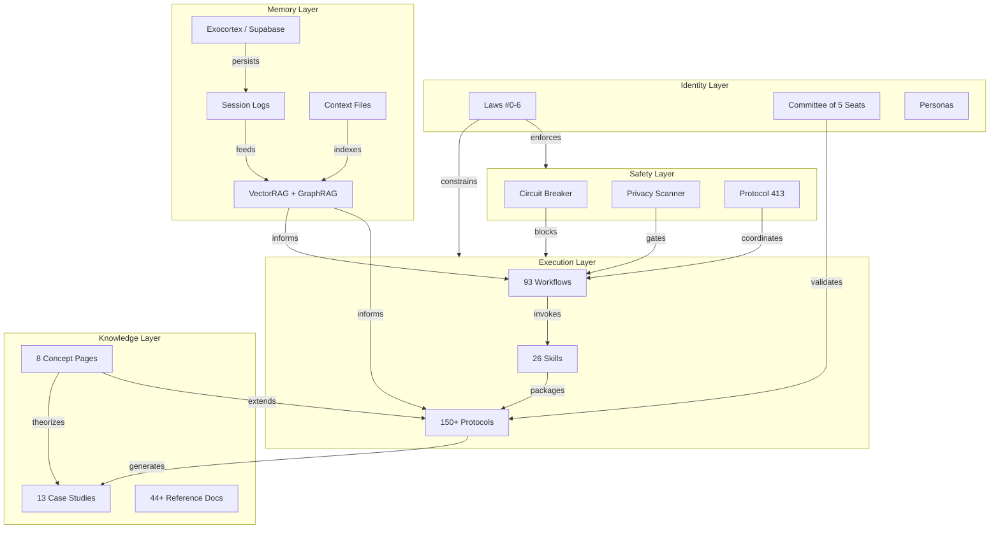

# Knowledge Graph — Athena System Architecture

> **Last Updated**: 12 May 2026
>
> **Version**: v9.8.8
>
> **Purpose**: Compressed representation of the full Athena knowledge domain for instant retrieval. All counts are filesystem-verified.

---

## System Architecture (Tree)

```text
[Athena System v9.8.8]
│
├── Identity Layer
│   ├── Laws: {#0 Ruin Prevention, #1 Context is King, #2 Charity with Limits,
│   │          #3 Observe Don't Absorb, #4 Earned Trust, #5 Question Everything,
│   │          #6 Maximum Depth Doctrine}
│   ├── Modes: {Bionic (autonomous), Proxy (drafting), Blank (raw model)}
│   ├── Committee: {Strategist, Guardian, Operator, Architect, Skeptic}
│   └── Personas: {Athena-Default, Consigliere, Red-Team Adversary}
│
├── Memory Layer
│   ├── Session Logs: Timestamped per-session records
│   ├── Context Files: {CANONICAL.md, project_state.md, TAG_INDEX.md}
│   ├── Exocortex: {Supabase Cloud Sync, Semantic Search, Vector Embeddings}
│   └── Retrieval: {VectorRAG, GraphRAG, Semantic Search, Context Compactor}
│
├── Execution Layer
│   ├── Workflows: 93 slash commands (/start → /web-build)
│   ├── Skills: 26 packaged capability modules (6 categories)
│   ├── Protocols: 150 active + 18 archived (15 categories)
│   └── Scripts: Privacy scanner, smart_search.py, test runners
│
├── Knowledge Layer
│   ├── Concepts: 8 documented thesis pages
│   ├── Case Studies: 13 total (6 example + 7 documented)
│   ├── Docs: 44+ reference documents
│   └── Wiki: 7 pages (Home, FAQ, Philosophy, etc.)
│
└── Safety Layer
    ├── Circuit Breaker: Ruin prevention gate
    ├── Privacy Scanner: Pre-commit secret/PII detection
    ├── Multi-Agent Coordination: Protocol 413
    └── Public Repo Guard: Deploy workflow sanitization
```

---

## Protocol Categories (150 Active)

| Category | Active | Archived | Key Protocols |
|----------|--------|----------|---------------|
| **Architecture** | 22 | 3 | P77 Adaptive Latency, P96 Latency Indicator, P409 Parallel Worktrees |
| **Decision** | 28 | 9 | P75 Synthetic Parallel Reasoning, P115 First Principles, P137 Graph of Thoughts, P140 Base Rate Audit |
| **Workflow** | 17 | 1 | P130 Vibe Coding, P72 Proactive Extrapolation |
| **Engineering** | 18 | 5 | P43 Micro-Commit, P51 Infrastructure Reset |
| **Reasoning** | 13 | 0 | Multi-model reasoning, convergence analysis |
| **Pattern Detection** | 10 | 0 | Behavioral pattern recognition, anomaly detection |
| **Strategy** | 8 | 0 | P244 Offensive Reframing, P245 Value Trinity, P303 Ecosystem Physics |
| **Meta** | 8 | 0 | System self-improvement protocols |
| **Safety** | 6 | 0 | Ruin prevention, circuit breakers |
| **Coding** | 5 | 0 | Diagnostic-first refactoring, audit standards |
| **Research** | 5 | 0 | P52 Deep Research Loop, P54 Cyborg Methodology |
| **Memory** | 3 | 0 | Session persistence, context compaction |
| **Verification** | 3 | 0 | P141 Claim Atomization Audit |
| **Trading** | 2 | 0 | Kelly criterion, risk management |
| **Content** | 1 | 0 | Content strategy protocols |

**Total**: 150 active + 18 archived = **168 protocols**

---

## Concept Pages (8)

| Concept | Core Thesis | Relates To |
|---------|-------------|------------|
| [Iteration Arbitrage](concepts/Iteration_Arbitrage.md) | Flat-rate AI lifts iteration ceiling; complex problems require N loops, not 1 | CS#7, Half-Half-Half, Maximum Depth |
| [Half-Half-Half Rule](concepts/Half_Half_Half_Rule.md) | Service pricing halves at each operator-size tier | CS#6, Iteration Arbitrage |
| [Time Compression Thesis](concepts/Time_Compression_Thesis.md) | 10× compression inverts thinking-to-doing ratio | CS#3, Quadrant IV |
| [Meta-Game Thesis](concepts/Meta_Game_Thesis.md) | Question whether the game itself is winnable | Amoral Realism, Grace Protocol |
| [Grace Protocol](concepts/Grace_Protocol.md) | Augment the human, don't replace them | Meta-Game, Committee of Seats |
| [Quadrant IV](concepts/Quadrant_IV.md) | Important-not-urgent is where compounding happens | Time Compression, Data Compounding |
| [Cognitive Architecture](concepts/Cognitive_Architecture.md) | Biological stack from atoms to organism | Identity Layer, Committee |
| [Outcome Economy](concepts/Outcome_Economy.md) | AI shifts value from output to outcomes; labor-leisure economics of augmentation | Time Compression, Half-Half-Half, Iteration Arbitrage |

---

## Case Studies (13 Total)

### Example Case Studies (6)

| ID | Title | Domain |
|----|-------|--------|
| CS-001 | Sunk Cost Career Pivot | Decision Making |
| CS-002 | Scope Creep Freelance | Project Management |
| CS-003 | Confirmation Bias Research | Research Methodology |
| CS-004 | Plea Bargain Diagnostic | Legal Analysis |
| CS-005 | Min-Max Purchasing Framework | Financial Decision |
| CS-006 | The Replacement Trap | Agency Displacement |

### Documented Case Studies (7, in `docs/CASE_STUDIES.md`)

| # | Title | Key Framework |
|---|-------|---------------|
| 1 | The Therapy Session That Changed Everything | Vulnerability Threshold |
| 2 | The Career Fork | Revealed-Preference Profile |
| 3 | The Life Management System | Routine Data Compounding |
| 4 | The Solo-Capitalist Pipeline | Distribution Physics |
| 5 | The Data Compounding Moat | 45-session compound effect |
| 6 | The $50,000 Agency vs $12,500 Solo Operator | Half-Half-Half Rule |
| 7 | The Consulting Convergence Problem | Iteration Arbitrage |

---

## Workflows (93)

| Category | Commands |
|----------|----------|
| **Boot/Close** | /start, /end, /ultrastart, /ultraend, /fresh, /resume, /save |
| **Reasoning** | /think, /ultrathink, /plan, /brief, /spec, /gto |
| **Research** | /research, /search, /steal, /research-arbitrage, /notebooklm-bridge |
| **Execution** | /vibe, /async-dev, /web-build, /notebook-portfolio, /voice-agent-deploy |
| **Quality** | /audit, /audit-code, /check, /test, /fix, /grill, /diagnose, /doctor |
| **Git** | /deploy, /release-public, /shorthand-commands |
| **Content** | /video, /ugc-factory, /brand-generator, /ads, /archive, /doc |
| **UI/UX** | /ui-check, /ui-ux-pro-max, /diagram |
| **Meta** | /project, /preset, /guide, /tutorial, /circuit, /blank, /dump |
| **Multi-Agent** | /416-agent-swarm, /bridge |

---

## Skills (26, across 6 categories)

| Category | Skills |
|----------|--------|
| **Business** | brand-foundations, client-pricing, distribution-physics, marketing-swarm, power-inversion |
| **Decision** | circuit-breaker, consiglieri-protocol, decision-journal, red-team-review, trading-risk-gate, zenith-execution |
| **Research** | deep-research-loop, semantic-search, seo-auditor, statistical-analysis |
| **Quality** | context-compactor, micro-commit, spec-driven-dev, visual-verify-ui |
| **Coding** | atomic-execution, git-worktree-swarm, synthetic-parallel-reasoning |
| **Workflow** | academic-delivery, academic-humanizer, trade-journal-analyzer, therapeutic-ifs |

---

## Relationship Map



---

## Key Relationships (Entity Map)

| Entity | Relates To | Relationship |
|--------|-----------|--------------|
| Law #0 (Ruin Prevention) | Circuit Breaker, Trading Risk Gate | Enforcement mechanism |
| Law #1 (Context is King) | All Retrieval, Session Logs | Design principle |
| Law #6 (Maximum Depth) | Iteration Arbitrage, /ultrathink | Depth > speed |
| Protocol 404 (Fetch & Reason) | All Skills | Foundation (retrieve before act) |
| Protocol 409 (Parallel Worktrees) | Protocol 416 (Agent Swarm) | Enables parallel agent execution |
| Protocol 413 (Multi-Agent Safety) | Git operations | No stash, no branch-switch, commit-only-yours |
| Iteration Arbitrage | Half-Half-Half Rule | Both exploit flat-rate AI economics |
| Time Compression | Quadrant IV | Freed time flows to important-not-urgent |
| Outcome Economy | Time Compression, Grace Protocol | Economic proof of why augmentation generates more value per hour |
| Grace Protocol | Meta-Game Thesis | Human augmentation = correct game to play |
| Data Compounding (CS#5) | All Case Studies | Compound effect is the moat |
| Vulnerability Threshold | USE_CASES.md | Prerequisite for all use cases |
| CANONICAL.md | All Concepts | Single source of truth (§1–§260+) |

---

## Quick Lookup

| Need | Go Here |
|------|---------|
| Lost context? | `session_logs/` for recent memory |
| Need a protocol? | `examples/protocols/` by category |
| Building new feature? | `docs/ARCHITECTURE.md` |
| Debugging AI behavior? | Laws in Core_Identity.md |
| Finding a concept? | `docs/concepts/` (7 thesis pages) |
| Understanding pricing? | Half-Half-Half Rule + Iteration Arbitrage |
| Understanding use cases? | `docs/USE_CASES.md` (3 core use cases) |
| Adding a case study? | `docs/CASE_STUDIES.md` (follow CS#7 format) |
| Running a workflow? | `examples/workflows/` (93 available) |
| Checking system health? | `/diagnose` workflow |
| Auditing cross-model? | `/audit` workflow |
| Adding a skill? | `examples/skills/` (follow SKILL.md format) |

---

## Counts Summary

| Category | Count |
|----------|-------|
| Active Protocols | 150 |
| Archived Protocols | 18 |
| Workflows | 93 |
| Skills | 26 |
| Concept Pages | 8 |
| Case Studies (total) | 13 |
| Docs Pages | 44+ |
| Wiki Pages | 7 |
| Protocol Categories | 15 |
| Skill Categories | 6 |
| Laws | 7 (#0–#6) |
| Committee Seats | 5 |
| Tags (TAG_INDEX) | 50+ |

---

*This graph is filesystem-verified as of 12 May 2026. Update via `/diagnose` workflow or manual audit.*
