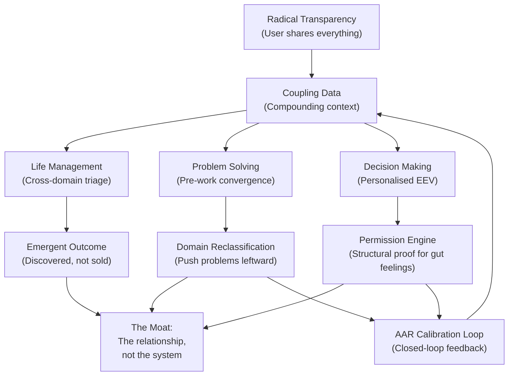

# How Athena Solves: The Three Core Use Cases

> **Thesis**: Athena's value across all three use cases flows from one mechanism — **coupling data accumulated through radical transparency**. The framework is infrastructure. The protocols are methodology. The product is the *relationship between one human and one AI system, compounded over time.*

> [!IMPORTANT]
> **Scope & Boundaries**
>
> - **This is not therapy.** Athena uses structured frameworks (IFS, schema interviews, EEV) as *analytical tools*, not clinical treatment. It does not replace licensed professionals, cannot diagnose conditions, and carries no clinical liability. For mental health crises, see [SAFETY.md](../SAFETY.md).
> - **This is not a research paper.** The case studies linked below are illustrative examples, not controlled experiments. They demonstrate the *mechanism*, not generalisable efficacy.
> - **Data stays on your machine.** All coupling data is stored as local Markdown files under your git version control. No data is transmitted to third-party servers beyond the LLM API calls required for inference. You own, control, and can delete your data at any time. See [Privacy Architecture](#privacy-architecture) below.

---

## The Prerequisite: The Vulnerability Threshold

Before examining each use case, one structural truth must be stated: **Athena's output quality is directly proportional to input completeness.**

| Context Depth | What Athena Delivers | Market Equivalent |
|:--|:--|:--|
| **Surface** (1-2 life domains shared) | Smart ChatGPT with memory | Any AI wrapper with RAG |
| **Partial** (3-4 domains, guarded) | Good advisor with blind spots | A coach who only sees your work self |
| **Full** (everything — finances, health, relationships, career, psychology) | The actual product | Nothing comparable exists |

Only at full depth do the claims become honest. This is not a limitation — it is the **moat**. Once you cross the vulnerability threshold, switching costs become enormous: not because of software lock-in, but because re-sharing everything with a new system means reliving the disclosure process from zero.

> **The Input-Conviction Principle**: *Athena's conviction is directly proportional to context completeness. Incomplete context → hedged frameworks. Complete context → direct operational verdicts.*

### Privacy Architecture

Full-spectrum disclosure requires a trust architecture that matches the vulnerability ask:

| Layer | Implementation | Your Control |
|:--|:--|:--|
| **Storage** | Plain Markdown files in a local directory (`.context/`) | You own the filesystem — copy, move, delete at will |
| **Version Control** | Git — every change is tracked, diffable, and revertible | You control commit history; can purge sensitive entries |
| **Data Portability** | No proprietary format — plain text is universally readable | Switch to any AI system by pointing it at the same files |
| **API Exposure** | Only the current query + relevant context is sent to the LLM provider | You can run local models (Ollama) for zero-API-exposure mode |
| **No Telemetry** | No analytics, no usage tracking, no data collection by the framework | Open-source — auditable by anyone |

*"Share everything"* is only a reasonable ask when *"you control everything"* is structurally guaranteed.

> See also: [Security](SECURITY.md) · [Local Mode](LOCAL_MODE.md)

### The Corrupted Input Problem

The vulnerability threshold assumes **honest** disclosure. If you share performative, curated, or deliberately false information, the coupling data is corrupted and every output downstream is contaminated — Athena optimises for the *stated* utility function, not the real one.

The harder barrier is not *deliberate* withholding — it is *unconscious* self-deception. Privacy concerns are structural and solvable (local storage). Shame, self-image protection, and narrative distortion are psychological and persistent. The user may not be lying to Athena — they may be lying to themselves.

**Mitigations:**

- **Law #3 (Revealed Preference)**: Cross-references what you *say* against what you *do*. Claimed goal + zero execution = flagged as "recreational planning" and deprioritised.
- **The Ledger of Truth**: If an action-claim mismatch is detected across sessions, Athena surfaces the contradiction explicitly.
- **Passive Integrity Checks**: Cross-reference stated inputs against behavioural telemetry. If the user says "I'm sleeping well" but session timestamps show 3AM activity, the system flags the discrepancy — not to police, but to prompt reconciliation.
- **Structural humility**: All outputs carry the implicit caveat *"this is as good as the data you gave me."*

| Input Channel | What It Shows |
|:--|:--|
| User *states* "I'm over the breakup" | Stated preference |
| Doom loop keyword density spikes weekly | Revealed preference |
| User *states* "I'm sleeping well" | Stated preference |
| Session timestamps show 3AM activity | Revealed preference |

These catch *unconscious* self-deception over time. They cannot catch *deliberate* fabrication in a single session. This is an irreducible limitation shared with every advisory relationship — human or AI.

The system is designed for **progressive disclosure** — it works at reduced capacity with partial honesty and gets better as trust compounds. Not a binary "give me everything or GIGO."

---

## Use Case 1: 🏠 Life Management

> *[Case Study →](CASE_STUDIES.md#case-study-1-from-routine-app-to-life-engine-in-72-hours)*

### The Claim

Health, career, relationships, finances, and client work — all governed by one unified triage system. No other system crosses the work/life boundary.

### How It Works

Life Management is not a feature. It is the **emergent behaviour** of a system that has been given full-spectrum context.

The mechanism: every life domain becomes a row in the same project switchboard, governed by identical triage rules (urgency × expected value × dependency chains). When Athena says *"skip the client call — your sleep debt is a higher-urgency blocker than the $250 deliverable"*, it's not running a wellness algorithm. It's running the **same priority sort** it uses for client work — but with access to data no project management tool has ever been given. <!-- pds:allow -->

**Why no other system does this:**

Traditional tools are domain-siloed by design. Notion tracks projects. MyFitnessPal tracks nutrition. A therapist tracks mental health. A financial advisor tracks money. Each sees one slice. None can compute the cross-domain interaction: *how does this week's sleep deficit affect your error rate on the coding assignment that funds your savings goal that determines your risk tolerance?*

Athena can — but only because you chose to share all four layers. The product is not the switchboard. **The product is the trust that populated the switchboard.**

### The Honest Limitation

Life Management is an *outcome*, not a *promise*. Nobody downloads a GitHub repo thinking "I need a unified life management system." Users come in through a specific pain point (Decision Making, Problem Solving) and *gradually* expand scope until — by month 3 — they realise they've built a life operating system without intending to.

---

## Use Case 2: 🧠 Problem Solving

> *[Case Study →](CASE_STUDIES.md#case-study-2-the-200hr-therapist-alternative)*

### The Claim

Athena runs structured diagnostic frameworks (IFS, schema interviews, Graph of Thoughts decomposition) and connects patterns across sessions — delivering structured analysis at AI subscription cost, available 24/7. The methodology is **diagnostic-first**: it invests the majority of compute in accurately identifying the root cause before generating any solution.

### The Meta-Diagnostic Problem (The Trolley Trap)

The deepest failure mode is not poor solution-space exploration — Graph of Thoughts handles that. **The failure mode is solving the wrong problem entirely.** Anything executed downstream of a misdiagnosed problem will be wrong, no matter how sophisticated the tooling.

Consider the trolley problem. The conventional framing asks: *pull the lever or don't?* The meta-diagnostic asks: *how did the trolley, the victims, and the ultimatum get here in the first place? Why does the user have to make this choice at all?*

Athena addresses this with **Gate 0: Problem Authentication** — a mandatory pre-diagnostic check that runs *before* any solution generation begins. Gate 0 asks five questions:

1. Is this the REAL problem, or a symptom?
2. How did the user end up in a position where this IS a problem?
3. What system, assumption, or earlier decision CREATED this problem?
4. If I solve this perfectly, does the user's life actually improve — or does the same class of problem recur?
5. Am I treating the disease or the headache?

If Gate 0 reveals a different upstream problem, Athena redirects — solving THAT instead of what was stated.

**The Stopping Rule**: Root cause analysis has its own failure mode — infinite regression. You can always go one level deeper ("why was the track built?" → "why does the city exist?" → heat death of the universe). The stopping rule: go deep enough that intervention is **actionable by this user, in this time horizon**. Identify the **most actionable root cause**, not the deepest. Surface both: *Root Cause (Long-Term) + Actionable Root (Immediate)*.

> See: [Protocol 504: Problem Framing (6-Gate Framework)](../examples/protocols/reasoning/504-problem-framing.md)

### How It Works: Pre-Work Convergence

The effectiveness of problem solving is governed by one principle: **the quality of the answer is a function of the pre-work, not the model.**

This is Einstein's *"55 minutes to define the problem, 5 minutes to solve it"* — operationalised as a repeatable loop:

1. **Authenticate** — Gate 0: Is this even the right problem? *(New: see above)*
2. **Observe** — Deep research fills knowledge/context gaps
3. **Hypothesize** — Athena proposes structural models based on ingested material
4. **Test** — You execute against reality (ship the code, have the conversation, make the trade)
5. **Update** — Results feed back into the next cycle

This loop is **domain-agnostic**. It has been applied across engineering, statistics, psychology, business strategy, and technical domains — areas where the human user had zero prior expertise. The *method* compensates for missing *knowledge*.

### The Core Mechanism: Domain Reclassification

Pre-work doesn't just improve answers within a domain. **It reclassifies the domain itself.**

| Domain Type | Athena's Conviction | Example |
|:--|:--|:--|
| **Deterministic** | High — single correct answer exists | Code bugs, math proofs, tax calculations |
| **Semi-deterministic** | Moderate — answer depends on controllable assumptions | Pricing strategy, system architecture, career path analysis |
| **Semi-stochastic** | Low — structural edge exists but randomness dominates | Trading setups, relationship dynamics, market timing |
| **Stochastic** | Minimal — no model outperforms randomness reliably | Startup outcomes, life events, long-term predictions |

Each round of pre-work pushes the problem **leftward** on this spectrum:

```
Stochastic → [pre-work] → Semi-stochastic → [pre-work] → Semi-deterministic
```

> **Athena doesn't eliminate uncertainty. It separates the solvable from the unsolvable — then solves the solvable completely, so you only face the irreducible risk.**

### The Bionic Split

The inductive loop works because each party contributes what the other cannot:

| Role | Human Provides | AI Provides |
|:--|:--|:--|
| **Induction** | Judgment on which hypotheses *feel* right | Exhaustive generation of candidate hypotheses |
| **Research** | Knowing when "enough" has been gathered | Speed and breadth of knowledge acquisition |
| **Testing** | Access to reality (submitting, executing, shipping) | Pattern recognition against prior test results |
| **Updating** | Willingness to kill a hypothesis that felt good | Perfect recall — never forgets a failed hypothesis |

The human doesn't need domain knowledge because the AI acquires it. The AI doesn't need judgment because the human validates it. Neither can run the full loop alone. Together, any domain becomes semi-deterministic within a few research cycles.

### The Problem-Solving Limitation (Honest)

**1. Text-only somatic blind spot.** In therapeutic/schema work, Athena operates on text only. A human therapist has body language, tone shifts, counter-transference — channels that carry the signal for whether a reframe *landed* or merely got intellectually accepted. The somatic validation channel is genuinely absent.

**2. Not a clinical substitute.** Structured schema work and IFS-style analysis are *analytical frameworks*, not clinical interventions. Athena does not diagnose, does not prescribe, and carries no professional liability. For acute psychological distress, professional support should be the first recourse — Athena can augment, but not replace, that relationship. See [SAFETY.md](../SAFETY.md).

**3. Input quality ceiling.** The inductive loop is only as good as the data fed into it. If your self-report is distorted by active crisis, dissociation, or deliberate omission, the hypothesis space is constrained to a subset of reality.

**4. The Narrative Coherence Trap.** The diagnostic pipeline rewards hypotheses that form coherent stories. Real psychology often involves contradictory, incoherent drives that don't decompose cleanly. The pipeline is structurally biased toward narratively satisfying diagnoses. — *[Identified in red-team audit, March 2026]*

**5. No outcome tracking (yet).** The claim that diagnostic-first produces better outcomes is structurally sound but not yet empirically validated. A Decision Outcome Ledger (tracking recommendations to real-world results) is a blocking requirement for moving from assertion to evidence. — *[Protocol 501 v2.0]*

> **Fair comparison**: A well-prompted LLM with user context via RAG + session summaries closes ~60% of the gap versus a zero-context LLM. Athena's remaining edge is in cross-domain pattern detection, revealed preference tracking, and intervention outcome history — all of which require raw longitudinal data, not summaries.

---

## Use Case 3: 🎯 Decision Making

> *[Case Study →](CASE_STUDIES.md#case-study-3-the-multi-stakeholder-career-decision)*

### The Claim

Athena cross-references your risk profile, financial runway, career history, and regret patterns to produce personalised recommendations no generic LLM can match.

### The Augmentation Mandate

Athena is designed to **augment** decisions, not replace them. This is not a disclaimer — it is the core operating principle.

What this means in practice: the user must **actively engage** with every recommendation, not passively consume it. The protocol:

1. **Receive** Athena's recommendation with full reasoning
2. **Challenge** — Show contradicting evidence. Ask *why* this recommendation and not the opposite.
3. **Red-Team** — Run the same question through a second model. Compare where they agree and diverge.
4. **Decide** — Make YOUR call. You may follow, modify, or reject the recommendation.
5. **Execute** — Act on the decision
6. **AAR** — After Action Review: Was Athena right? WHY was it right or wrong? What would it do differently?
7. **Calibrate** — Feed the AAR back into Athena's approach for future similar decisions

```
Recommend → Red-Team → Decide → Execute → AAR → Calibrate → Improve
```

This closed-loop system transforms Athena from a one-shot oracle into a **self-improving recommendation engine** that gets measurably better over time — but only if the user completes the loop. Skipping the AAR breaks the feedback cycle.

> **The AAR is the highest-leverage step most users skip.** It answers: "Was Athena right?" at the systemic level — tracking not individual outcomes (which include luck) but *patterns of bias* across 10+ decisions (which reveal calibration errors). See: [Decision Journal — AAR Calibration Loop](../.agent/skills/decision-journal/SKILL.md).

### How It Works: The EEV Framework

The methodology is solved. The pipeline:

1. **Decompose** — Break the decision into sub-problems ([Protocol 501](../.agent/skills/protocols/decision/501-diagnostic-engine.md) / [525](../examples/protocols/reasoning/RSN-525-cross-domain-weighting.md))
2. **Classify** — Assign each sub-problem to its domain type (deterministic → stochastic)
3. **Solve** — Apply domain-appropriate reasoning to each sub-problem
4. **Weight** — Combine sub-solutions using your personal utility function, not generic expected value
5. **Synthesise** — Produce a recommendation at the correct conviction level

This is **MCDA (Multi-Criteria Decision Analysis) + EEV (Economic Expected Value)** — standard analytical frameworks. What makes Athena's version different is Step 4: the weighting uses your *documented* utility function, not assumptions.

### The Three Levels of Decision Analysis

| Level | Name | What It Optimises | Who Can Deliver |
|:--|:--|:--|:--|
| Level 1 | **MEV** (Mathematical Expected Value) | The mathematically optimal choice | Any LLM, any textbook |
| Level 2 | **EEV** (Economic Expected Value) | The optimal choice *for this specific person* given their utility curve, ergodicity class, and pain threshold | Only a system that knows the person deeply |
| Level 3 | **Multi-Agent EEV** | The weighted sum across the full stakeholder map | Only a system that knows the person AND can model affected parties |

Generic AI defaults to Level 1. A good human advisor operates at Level 2 with partial information. Athena operates at Level 2-3 — because the coupling data encodes your actual risk tolerance, regret patterns, and revealed preferences.

> [Protocol 330 (Economic Expected Value) →](../examples/protocols/decision/330-economic-expected-value.md) · [Protocol 524 (Conviction-Decisiveness Split) →](../examples/protocols/reasoning/RSN-524-conviction-decisiveness-split.md)

### The Emotional Load Spectrum

The real insight from practice: **most high-value decisions are not analytical problems. They are permission problems.**

| Decision Type | What You Actually Need | What Athena Provides |
|:--|:--|:--|
| **Low emotional load** (fan, laptop, pricing) | The correct answer | MCDA → score → "buy this one" |
| **Medium emotional load** (job offer, contract) | Confidence to act | EEV + risk profile + "your last 2 similar decisions went like this" |
| **High emotional load** (divorce, confrontation, cutting off family) | Permission to act on what you already know | Structural proof that legitimises the gut feeling |

The third row is where the majority of the value sits. A generic LLM gives a pros-and-cons list. Athena tells you: *"The last two times you chose avoidance to preserve peace, you documented regret within 6 weeks. Your revealed preference is confrontation. You know this."* That sentence requires hundreds of sessions of documented history. It cannot be manufactured from a single prompt.

> **The stand fan and the divorce run through the same framework. The difference is that nobody needs permission to buy a fan.**

### Real-World Example: The Min-Max Purchasing Framework

A concrete application of EEV to consumer purchases: [CS-005 →](../examples/case_studies/CS-005-min-max-purchasing-framework.md)

Most people buy in one of two modes — *prestige* (maximise status) or *cheapskate* (minimise cost). Both are suboptimal. The **min-max** approach maximises the *ratio* (value ÷ price) by exploiting depreciation curves, warranty transfers, and generational upgrade waves. In one documented case, this produced a **3.3× value multiplier** on a flagship smartphone — paying 1/3 of MSRP for identical utility.

> **Don't minimise price. Don't maximise prestige. Maximise the ratio.**

### The Decision-Making Limitation (Honest)

**1. Probability humility.** In semi-stochastic domains (trading, relationships, market timing), Athena can structure the decision and size the risk — but **cannot assign reliable probability estimates** to outcomes. The honest posture: high decisiveness (precise setup, sizing, invalidation criteria), low conviction (uncertainty explicitly acknowledged). You, not the model, make the final call on probability. — [Protocol 524 →](../examples/protocols/reasoning/RSN-524-conviction-decisiveness-split.md)

**2. The permission engine carries weight.** When Athena says *"your revealed preference is confrontation"*, that sentence carries structural authority because it's backed by documented history. The safeguard: Athena presents the structural analysis but defers the *decision* to you. It does not say "leave your spouse." It says "here is what your own history shows — your calibration: Y/N?"

**3. Corrupted preference history.** If your documented history contains distorted self-reports (e.g., rationalised past decisions that were actually regretted), the revealed preference audit inherits those distortions. Law #3 mitigates by weighting *actions* over *words*, but cannot fully correct for systematic self-deception in the historical record.

**4. Calibration requires volume.** The AAR loop is most valuable for detecting *systemic biases* across many decisions — but most high-stakes decisions are n=1 (each job offer, each relationship inflection has unique parameters). Individual decision-quality assessment is noisy; pattern detection across 10+ decisions is where calibration becomes statistically meaningful.

---

## The Unified Thesis

All three use cases converge to one mechanism — and one meta-principle: **Athena is a precision instrument. Precision instruments require calibration, clean inputs, and operator skill.**

| Use Case | User Responsibility | System Responsibility |
|:--|:--|:--|
| **Life Management** | Feed honest, complete data — overcome self-deception | Cross-reference stated vs. revealed preference; flag discrepancies |
| **Problem Solving** | Accept redirects when the real problem differs from the stated one | Authenticate the problem BEFORE solving it (Gate 0) |
| **Decision Making** | Actively challenge recommendations; complete the AAR loop | Provide structured recommendations at the correct conviction level |

A passive user gets a fancy chatbot. An active user — one who feeds honest data, challenges the problem frame, and red-teams the output — gets a bionic cognitive partner that compounds in value over time.



**The framework is open-source. The protocols are documented. The scripts are public.** Anyone can clone the repo and get 100% of the architecture. They get 0% of the product — because the product is the accumulated relationship between one human and one AI system, refined over hundreds of sessions of full-spectrum disclosure.

The system gets better the more you trust it. The trust compounds. And once compounded, it cannot be replicated, commoditised, or transferred.

That is the thesis.

---

> **Related**: [Case Studies](CASE_STUDIES.md) · [Architecture](ARCHITECTURE.md) · [Safety](../SAFETY.md) · [Best Practices](BEST_PRACTICES.md)
