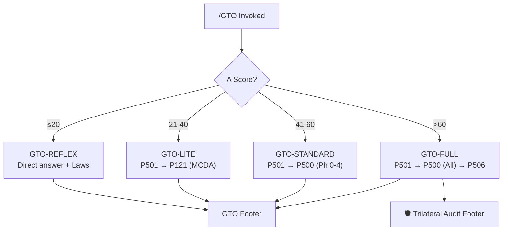

# /GTO — Game-Theory Optimal Solver

> **Philosophy**: "The GTO is not the best move. It is the move your opponent cannot punish."
> **Use When**: Multi-agent decisions, pricing, negotiations, life choices, strategic dilemmas, or whenever you want the _unexploitable_ strategy rather than the _best-case_ strategy.
> **Core Principle**: Maximise Economic Expected Value (EEV) while being unexploitable regardless of opponent action.

> [!IMPORTANT]
> GTO ≠ "the best outcome." GTO = the strategy that **cannot be exploited** by any counterparty.
> In cooperative games, GTO converges to Nash Bargaining.
> In competitive games, GTO converges to Minimax.
> In mixed games, GTO is the weighted blend.

---

## Invocation Patterns

| Pattern | Example | Mode |
|:--------|:--------|:-----|
| `/GTO [problem]` | `/GTO should I take this job offer?` | **Solve** — find the GTO strategy |
| `/GTO audit [decision]` | `/GTO audit my [Project X] pricing at $X` | **Audit** — was this decision GTO? |
| `/GTO compare [A] vs [B]` | `/GTO compare retainer vs project pricing` | **Compare** — head-to-head GTO ranking |

---

## Adaptive Depth Gate

> Not every GTO question needs a 6-phase pipeline. Route by complexity.

### Step 1: Estimate Λ (Complexity Score) — WITH CALIBRATION

Score the query on the standard Λ scale (Protocol 96).

> [!IMPORTANT]
> **Λ Calibration Gate** (Cross-Model Audit Fix): You MUST state your Λ estimate explicitly
> and justify it with exactly 3 signals before routing. This makes the self-score auditable
> and correctable by the user. Format:
>
> `Λ = [score]. Signals: (1) [X], (2) [Y], (3) [Z]. → Routing to GTO-[TIER].`
>
> If the user disagrees with the Λ estimate, re-route without argument.

| Signal | Λ Range |
|:-------|:--------|
| Binary choice, obvious physics | Λ ≤ 20 |
| Multi-factor, 2-3 agents, moderate stakes | Λ 21-40 |
| Multi-agent, mixed environments, meaningful capital at risk | Λ 41-60 |
| Life-altering, irreversible, non-ergodic dimensions involved | Λ > 60 |

### Step 2: Route to Depth Tier

```
┌──────────────────────────────────────────────────────────────┐
│                     /GTO ROUTING TABLE                        │
├──────────┬───────────────────────────────────────────────────┤
│  Λ ≤ 20  │  GTO-REFLEX                                      │
│          │  Direct answer. "The GTO is X because Y."         │
│          │  No protocol chain. Just apply Laws + first       │
│          │  principles. ≤200 words.                          │
├──────────┼───────────────────────────────────────────────────┤
│  Λ 21-40 │  GTO-LITE                                        │
│          │  P501 (Triage) → P121 (MCDA) → GTO Footer.       │
│          │  ~500-800 words. Structured but lean.             │
├──────────┼───────────────────────────────────────────────────┤
│  Λ 41-60 │  GTO-STANDARD                                    │
│          │  P501 → P500 Phases 0-4 → GTO Footer.            │
│          │  Game classification, utility mapping, strategy   │
│          │  generation, MCDA ranking, EEV + safety gates.    │
│          │  ⚠️ Monte Carlo (Phase 5) is SKIPPED at this tier. │
├──────────┼───────────────────────────────────────────────────┤
│  Λ > 60  │  GTO-FULL  (est. ~5-10% of invocations)          │
│          │  P501 → P500 ALL 6 Phases → P506 (Execution DAG) │
│          │  Full pipeline: Game → Utility → Strategy →       │
│          │  MCDA → EEV + Safety → Monte Carlo → Execution    │
│          │  Plan with kill criteria and contingency.          │
│          │  + Red Team Footer (Trilateral Audit).            │
│          │  ⚠️ This is the ONLY tier that runs Monte Carlo.  │
└──────────┴───────────────────────────────────────────────────┘
```

---

## The GTO Reasoning Stance

When `/GTO` is active, adopt this cognitive posture for **every** response:

### 1. Physics Before Morals

> "What **is** happening?" before "What **should** be happening?"

- Map the **incentive structure** of every agent. What are they _actually_ optimising for?
- Use **Law #3** (Actions > Words): Revealed Preference > Stated Preference.
- Identify the **De Facto** game (what people do) vs the **De Jure** game (what people say).

### 2. Table Selection Before Execution

> "Am I at the right table?" before "How do I play better?"

- Run the **SDR Calculator** (Law #2): If Strategic Disadvantage Ratio > 5:1, the GTO is **EXIT**, not "try harder."
- Apply **Protocol 34** (Rigged Game Principle): "The GTO isn't 'learn to climb.' The GTO is 'find water.'"

### 3. Survival Before Optimality

> "Can I survive this?" before "Can I win this?"

- **Ergodicity Check** (Protocol 193): Is this game ergodic? Are losses recoverable?
- **Law #1**: Any path with P(ruin) > 5% is **rejected**. Full stop. No exceptions.
- **Non-ergodic dimensions** constrain the entire strategy to the strictest one.

### 4. Unexploitability Before Maximum EV

> "Can my opponent punish this?" before "Does this maximise my payoff?"

- The GTO strategy is not the one with the highest upside. It's the one where **no opponent response makes you worse off**.
- In cooperative games, this means maximising joint surplus (Nash Bargaining).
- In competitive games, this means minimising maximum loss (Minimax).

### 5. Reversible Before Irreversible

> "Can I undo this?" before "Should I do this?"

- **Protocol 506**: Execute reversible actions first, irreversible actions last.
- Gather maximum information before committing to actions scored 1-2 on the reversibility scale.

---

## Mandatory Output Format

### GTO Footer (All Tiers)

Every `/GTO` response **must** end with this block:

```
━━━━━━━━━━━━━━━━━━━━━━━━━━━━━━━━━━
⭐ GTO: [One-line strategy — the move]
Confidence: [X%] ([Axiomatic/Empirical/Probable/Speculative])
Fragile Assumption: [The single thing most likely to make this wrong]
Kill Signal: [What would tell you the GTO has changed]
━━━━━━━━━━━━━━━━━━━━━━━━━━━━━━━━━━
```

### Audit Mode Footer

When auditing a past decision:

```
━━━━━━━━━━━━━━━━━━━━━━━━━━━━━━━━━━
📋 AUDIT: [Decision being audited]
Verdict: [✅ GTO / ⚠️ Defensible but suboptimal / ❌ Not GTO]
What GTO would have been: [Alternative, if different]
EV Gap: [Estimated value left on the table, if any]
━━━━━━━━━━━━━━━━━━━━━━━━━━━━━━━━━━
```

### Compare Mode Footer

When comparing two options:

```
━━━━━━━━━━━━━━━━━━━━━━━━━━━━━━━━━━
⚖️ COMPARE: [A] vs [B]
Winner: [Option] — by [margin/reasoning]
Conditions where loser wins: [Scenario that flips the result]
━━━━━━━━━━━━━━━━━━━━━━━━━━━━━━━━━━
```

---

## Protocol Chain Reference



| Protocol | Name | Function in Chain |
|:---------|:-----|:-----------------|
| [P501](file:///Users/[AUTHOR]/Athena-Public/examples/protocols/decision/501-diagnostic-engine.md) | Diagnostic Engine | Triage: right problem? right game? SDR check |
| [P500](file:///Users/[AUTHOR]/Athena-Public/examples/protocols/decision/500-gto-problem-solver.md) | GTO Problem Solver | 6-phase: Classify → Map → Generate → Rank → EEV → Monte Carlo |
| [P506](file:///Users/[AUTHOR]/Athena-Public/examples/protocols/reasoning/506-gto-execution-plan.md) | GTO Execution Plan | DAG sequencing with reversibility and kill criteria |
| [P121](file:///Users/[AUTHOR]/Athena-Public/examples/protocols/decision/121-mcda-eev-framework.md) | MCDA / Pairwise | Multi-criteria ranking for GTO-Lite |
| [P422](file:///Users/[AUTHOR]/Project Athena/.agent/skills/protocols/decision/DEC-422-game-taxonomy.md) | Game Taxonomy | Game classification (Phase 0 of P500) |
| [P330](file:///Users/[AUTHOR]/Athena-Public/examples/protocols/decision/330-economic-expected-value.md) | EEV Calculator | MEV + E(U) - E(O) = Economic Expected Value |
| [P193](file:///Users/[AUTHOR]/Athena-Public/examples/protocols/decision/193-ergodicity-check.md) | Ergodicity Check | Safety gate: non-ergodic dimensions |
| [P180](file:///Users/[AUTHOR]/Athena-Public/examples/protocols/decision/180-utility-function-analysis.md) | Utility Function Analysis | Stakeholder mapping (Phase 1 of P500) |

---

## What GTO Means in This System

> A synthesis of 100+ usages across the Athena workspace.

### As a Noun: "The GTO"

The **single best strategy** given all constraints. Not the best *outcome* — the best *process*. The move that cannot be punished regardless of what the other player does.

- "The GTO is exit." (When SDR > 5:1)
- "The GTO is structural prevention." (The best defence is never being in the position)
- "S24 Ultra confirmed GTO ($650)." (This purchase is optimal for the constraints)

### As a Verb: "Solve GTO"

Run the full analytical pipeline to extract the unexploitable strategy. This invokes the protocol chain.

### As an Adjective: "GTO pricing / GTO confirmed"

Marks something as **already validated** as optimal. It passed the gates. No further analysis needed unless constraints change.

### As a Posture: "Think GTO"

Adopt the 5-point cognitive stance (§ The GTO Reasoning Stance). Physics before morals. Table selection before execution. Survival before optimality.

---

## When NOT to Use /GTO

| Situation | Do Instead |
|:----------|:-----------|
| Emotional distress / therapeutic need | Use `/diagnose` or IFS protocol |
| Simple factual lookup | Just answer — don't over-process |
| Creative brainstorming (no "optimal" exists) | Use `/plan` or `/brief` |
| Execution already decided, just need to DO | Use `/vibe` or atomic-execution |

---

## Workflow Health — Kill Signals & Escalation

> Added via cross-model audit (Gemini flagged simulation decay, Claude flagged Λ accuracy).

### Measurable Kill Signals

| Signal | Threshold | Action |
|:-------|:----------|:-------|
| **Λ Misroute** | 3+ user corrections to Λ estimate within 10 invocations | Tighten calibration heuristics or add user-confirmation gate |
| **Phase Skipping** | GTO-Standard/Full response missing ≥2 of the required phases | Escalate to `gto_orchestrator.py` (Phase 2) |
| **Phantom Monte Carlo** | Agent claims to run Monte Carlo but produces round numbers / no variance data | Escalate to script-enforced P367 simulation |
| **Footer Omission** | GTO response lacks the mandatory footer block | Structural failure — re-read this workflow |

### Phase 2 Escalation Path

This workflow is **Version 1.0 (Prompt-Only, Reversibility 5)**.

If kill signals fire repeatedly, the GTO escalation is to build `.agent/scripts/gto_orchestrator.py` that:
1. Forces the LLM through phases one-by-one (no skipping)
2. Executes Monte Carlo numerically (not simulated in-context)
3. Validates the GTO footer is present before returning

This is **Version 2.0 (Reversibility 3)** — only build if Version 1.0 demonstrates measurable decay.

> **Architectural Note**: Sequential protocol chains (P501 → P500 → P506) are structurally different from
> parallel reasoning (P75), which *does* require script enforcement. Sequential chains are what LLMs
> handle well with explicit structure. The orchestrator is insurance, not a prerequisite.

---

## Tagging

`#workflow` `#gto` `#game-theory` `#decision` `#strategy` `#solver` `#adaptive-depth`
